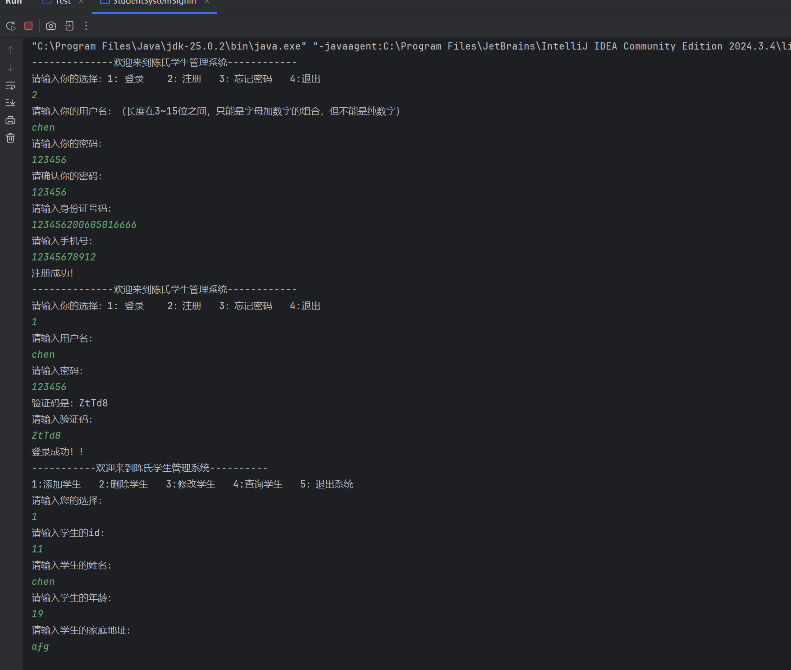

# 如梦初醒

## 2025.3.16打卡 Day 1
**1. 学习JavaSE基础：**  
* 方法的定义和调用
* 方法的重载
* 方法的基本内存原理
* 封装
* 就近原则和this关键字 
* 构造方法
* API帮助文档的查询使用
* String字符串的比较、拼接、反转

**2. Java语法练习：**
* 方法重载的练习：
```java
//定义：
    public static  int getSum(int a,int b){
        return a+b;
    }
    public static  int getSum( int a,int b,int c){
        return a+b+c;
    }
    public static double getSum(double a,double b){
        return a+b;
    }
//调用:
    int result =getSum(13 ,45);
    double result2 =getSum(1.4,4.3);
    int  result3= getSum(4,6,8);
    System.out.println(result+" "+result2+" "+result3 );
//结果：58 5.7 18
```
* 生成5位数的验证码：
```java
    char[] ch = new char[52];
    int index = 0;
    for (int i = 0; i < ch.length; i++) {
        //存小写字母
        if (i <= 25) {
            ch[index++] = (char) ('a' + i);
        } else {
                 ch[index++] = (char) ('A' + i - 26);
        }
    }
```
* 数字加密：
```java
 //将每位数字存进数组
   int[] nums=new int[length];
   for(int i=0;i<length;i++){
       int digit =num%10;
       nums[i]=(digit+5)%10;
       num/=10;
   }
   得到新数字
   int newnum =0;
   for(int i=0;i<length;i++)
   {
       newnum=newnum*10+nums[i];
   }
   return newnum;
```
* 字符串练习(登录系统、统计字符串字符数、字符串反转)
* 字符串练习（金额转换）：
```java
    //将传入的数字转成大写
    public static String getCapitalNum(int a){  
        String[] str={"零","壹","贰","叁","肆","伍","陆","柒","捌","玖"};
        return str[a];
    }
    public static void printCapitalNum(int num){
        String newstr="";
        while(num>0){
            int ge=num%10;
            newstr=getCapitalNum(ge)+newstr;
            num/=10;
        }
        String[] array={"佰","拾","万","仟","佰","拾","元"};
        String result="";
        for (int i = 0; i <newstr.length() ; i++) {
            result=result+newstr.charAt(i)+array[i+7-newstr.length()];
        }
        System.out.println(result);
    }
```
#ps:感觉今天收获满满


## 2026.3.17 打卡Day 2 

**1.学习Java基础**：
* StringBuilder的基本操作
* stringJoiner的基本操作
* 链式编程
* 字符串相关类的底层原理：
  * 字符串直接赋值会复用字符串常量池中的，new出来的不会进行复用，而是开辟一个新的空间
  * == 号比较时：基本数据类型比较数据值，引用数据类型比较地址值
  *  字符串拼接时：如果没有变量参与，都是字符串直接相加，编译之后就是拼接之后的结果，会复用字符串池中的字符串；  
如果有变量参与，则会创建新的字符串，浪费内存、浪费性能（拼接一次产生了两个对象，一个StringBuilder对象，一个String对象）


**2.leetcode刷题：**
1.两数之和
```java
 public int[] twoSum(int[] nums, int target) {
        for (int i = 0; i < nums.length; i++) {
            for (int j = i + 1; j < nums.length; j++) {
                if (nums[i] + nums[j] == target) {
                    return new int[] { i, j };
                }
            }
        }
        //如果没有找到，返回一个长度为0的空数组
        return new int[0];
 }
```
4.寻找两个正序数组中的中位数（双指针）
```java
    public static double findMedianSortedArrays(int[] nums1, int[] nums2) {
        int[] arr = new int[nums1.length + nums2.length];
        //定义两个指针来分别指向两个数组的首位，按照从小到大的顺序将其中元素放到大数组arr中，同时注意指针更新
        int ptr1 = 0;
        int ptr2 = 0;
        int k = 0;
        while ((ptr1 < nums1.length && ptr2 < nums2.length)) {
            if (nums1[ptr1] < nums2[ptr2]) {
                arr[k++] = nums1[ptr1++];
            } else {
                arr[k++] = nums2[ptr2++];
            }
        }
        //若比对完，则将剩下元素全部放到arr中
        while (ptr1 < nums1.length){
            arr[k++]=nums1[ptr1++];
        }
        while (ptr2 < nums2.length){
            arr[k++]=nums2[ptr2++];
        }
            //得到大数组之后从两边往中间归并
            int left = 0;
        int right = arr.length - 1;
        while (left < right) {
            left++;
            right--;
        }
        double s=arr[left]+arr[right];
        return s/2;
    }
```
26.删除有序数组中的重复项返回删除后的长度（双指针）
```java
   public static int removeDuplicates(int[] nums) {
        int n = nums.length;
        int left = 0;
        int right = 1;
        while (right < n) {
            if (nums[left] != nums[right]) {
                nums[++left] = nums[right];
            }
            right++;
        }
        //left是索引，所以最后长度1加一
        return left + 1;
    }
```
## 2026.3.18打卡Day 3
**1.学习Java基础：**
* 集合的基本使用
* 集合的练习  

**2.配置openclaw:**
* 成功在电脑上配置openclaw
* 成功将openclaw连接到QQ机器人

#ps：今天的效率很低，主要事件浪费在了解决openclaw不同模型的API接入吧，
发现不同的大模型token也不同，原来养龙虾这么耗财耗力，但也终究开始成功开始养我的第一个龙虾，给它起名为一粒吧，谐音毅力，而且寓意只看眼前一厘米，踏实做好眼前事。


## 2026.3.19打卡Day 4
**1.学习Java基础：**
* 学习Arraylist基本使用(ArrayList<泛型> list = new ArrayList<>();)
  * 增：list.add(数据); 返回值：boolean
  * 删：
    * 直接删数据：list.remove(数据) 返回值类型：boolean
    * 删索引：list.remove(索引)  返回值类型：泛型 
  * 改：list.set(索引,数据)  返回值类型：泛型
  * 查：list.get(索引)  返回值类型：泛型
  * ArrayList不能存放基本数据类型，只能存放引用数据类型和包装类
    * 包装类

      | 基本数据类型  | 包装类       |
      |:--------|:----------|
      | byte    | Byte      |
      | short   | Short     |
      | char    | Character |
      | int     | Integer   |
      | long    | Long      |
      | float   | Float     | 
      | double  | Double    |
      | boolean | Boolean   |
* 学习static关键字
  * 静态方法只能访问静态，不能访问非静态
  * 非静态方法可以访问所有
  * 静态方法中没有this关键字
* 学习工具类

**2.Java语法练习：**
* 练习增删改查
* 练习集合的遍历、集合创建、集合的各种方法

**3.Java项目实践：**

**通过将之前所有学习到的知识进行融合，成功写出来自己第一个JAVA项目：学生管理系统和登录系统**

包括登录系统（注册、登录、忘记密码、退出），管理系统（增、删、改、查、退出）并对输入的字符串都具有检验的功能，若输入的不合法，则需要重新输入


#ps:我的第一个项目，耗时长达4个小时，但收获也颇丰~


## 2026.3.20 打卡Day5
**1.学习JAVA基础**
* 学习static关键字
  * 被static修饰的成员变量叫做静态变量，被该类的所有对象共享
  * 随着类加载而加载，优先于对象存在
  * 静态只能修饰静态
  * 不属于对象，属于类，推荐使用类名调用
  * 静态方法多用在测试类和工具类中,推荐使用类名调用
* 学习继承（抽取共性为父类）
  * 支持单继承，不能多继承，可以多层继承
  * this（成员）关键字和super（父类）关键字
**2.java语法练习**
  * static关键字练习
  * 继承练习


    


## 2026.3.21 打卡Day6
**1.学习JAVA基础**
* 学习多态
  * 调用变量：编译看左边，运行看左边
  * 调用方法：编译看左边，运行看右边
  * 多态的优势：使用父类型作为参数，可以接收所有子类对象
  * 多态的弊端：不能使用子类的特定功能（可以使用强制类型转换来解决）
* 学习包和`final`关键字
  * 包的命名和需要导包的情况 
  * final修饰的变量不能被修改，修饰的类不能被继承，修饰的方法不能被重写
* 学习权限修饰符
    * private<默认<protected<public
* 学习代码块
    * 局部代码块、构造代码块、静态代码块
* 学习抽象类和抽象方法
    * 在继承的过程中，如果抽取子类共性时无法确定方法体，就把方法定义为抽象的
    * 抽象方法的格式：`public abstract 返回值类型 方法名(参数列表)；`  
    * 抽象类的格式：`public abstract class 类名{}`
    * 抽象方法所在的类必须是抽象类，抽象类的子类一定要进行抽象方法的重写


**2.JAVA语法练习**
* 多态的相关练习
* 抽象类的练习

3.leetcode刷题
206.反转链表
* 迭代法，依次让每个节点指向前一个节点，当前节点后移，返回pre
```java
class Solution {
    public ListNode reverseList(ListNode head) {
        ListNode cur = head, pre = null;
        while(cur != null) {
            ListNode tmp = cur.next; // 暂存后继节点 cur.next
            cur.next = pre;          // 修改 next 引用指向
            pre = cur;               // pre 暂存 cur
            cur = tmp;               // cur 访问下一节点
        }
        return pre;
    }
}
```
* 递归法，递归反转当前节点后续的节点，返回反转后的头结点，让反转后的尾节点指向当前节点
```java
class Solution {
    public ListNode reverseList(ListNode head) {
        if (head == null || head.next == null) {
            return head;
        }
        ListNode newHead = reverseList(head.next);
        head.next.next = head;
        head.next = null;
        return newHead;
    }
}
```

## 2026.3.22 打卡Day7
**1.学习Java基础**
* 接口
* 内部类
  * 成员内部类：写在成员变量位置的内部类（类中方法外，无static修饰）
  * 局部内部类：定义在方法内部的类，作用域仅限于该方法
  * 静态内部类：定义在类中方法外，有static修饰，仅能访问外部类的静态成员，且创建不依赖外部实例
  * 匿名内部类：定义在表达式或参数中，临时实现接口或抽象类（在实现函数式编程时，可以被Lambda表达式取代用于简化函数式接口）

**2.Java小游戏**
* 使用JFrame ,JMenubar实现GUI图形化界面的搭建
* 在JMenu中添加JMenuItem
* 初始化数据（用二维数组来存储）
* 初始化图片 使用二维数组，ImageIcon,JLabel将图片加载到隐藏内容面板中  :this.getContentPane().add(JLabel);
* 设置键盘监听
* 实现图片移动逻辑

3.leetcode刷题
* 21.合并有序链表（迭代法，穿针引线使两个链表使用归并算法穿起来）
```java
public static ListNode mergeTwoLists(ListNode list1, ListNode list2){

        ListNode prevhead=new ListNode(-1);
        ListNode prev=prevhead;

        while(list1!=null&&list2!=null){
            if(list1.val<list2.val){
                prev.next=list1;
                list1=list1.next;
            }else {
                prev.next=list2;
                list2=list2.next;
            }
            prev=prev.next;
        }
        
        prev.next=list1==null? list2:list1;
        return prevhead.next;
    }
```
* 209.长度最小的子数组（滑动窗口法）
```java
public static int minSubArrayLen(int target, int[] nums) {
        int left=0;
        int right=0;
        int sum=0;
        int result=Integer.MAX_VALUE;
        while(right<nums.length){
            sum+=nums[right];
            while(sum>=target){
                int currentlength=right-left+1;
                result =Math.min(result,currentlength);
                sum-=nums[left];
                left++;
            }
            right++;
        }

        return result==Integer.MAX_VALUE? 0:result;

    }
```

## 2026.3.23打卡Day8
**1.java基础学习**
* Math类
* System类
* Runtime类
* Object类
* BigInteger类
* BigDecimal类
* 正则表达式
* 爬虫
* Lambda表达式

**2.Java语法练习**
* 各种API的练习

**3.leetcode刷题**
* 876.寻找链表中间节点 （快慢指针法）
```java
 public static ListNode middleNode2(ListNode head){
  ListNode fast=head;
  ListNode slow=head;
  while(fast!=null&&fast.next!=null){
    slow=slow.next;
    fast=fast.next.next;
  }
  return slow;
}
```

* 19.删除链表倒数第n个节点(快慢指针法)
```java
public static ListNode removeNthFromEnd(ListNode head, int n) {
        ListNode dummy=new ListNode(0,head );
        ListNode fast=head,slow=dummy;
        for (int i = 0; i < n; i++) {
            fast=fast.next;
        }
        while(fast!=null){
            fast=fast.next;
            slow=slow.next;
        }
        slow.next=slow.next.next;

        return dummy.next;
    }
```
## 2026.3.24打卡Day8
**1.学习java基础**
* Arrays相关方法使用
  > public static String toString(数组) //把数组拼成一个字符串  
  > public static int binarySearch(数组，查找的元素)  //二分查找元素  
  > public static int[] copyOf(原数组，新数组长度)  //拷贝数组
  > public static int[] copyOfRange(原数组，起始索引，结束索引) // 拷贝数组  
  > public static void fill(数组，元素)  // 填充数组  
  > public static void sort(数组)  // 按照默认方式进行数组排序  
  > public static void sort(数组， 排序规则)  //按照指定规则来排序（lambda表达式来定义排序规则）

* 迭代器
* 增强for（增强for不能用来删除元素，应该使用迭代器，modcount==expectedcount）
* ArrayList及其扩容机制
* LinkedList（可以在ArrayList的基础上实现保持插入顺序）
* 泛型，泛型类，泛型方法

**2.leetcode刷题**
* 160.相交链表  
    方法一：Hashset
```java
      public static ListNode getIntersectionNode(ListNode headA ,ListNode headB){
         HashSet<ListNode> set =new HashSet<>();
         ListNode curA =headA;
         ListNode curB =headB;

         while(curA!=null){
            set.add(curA);
            curA=curA.next;
         }
         while(curB!=null){
            if(set.contains(curB)){
                return curB;
            }
            curB=curB.next;
         }
         return null;
      }
```
  方法二：双指针
```java
    public static ListNode getIntersectionNode2(ListNode headA ,ListNode headB){
        ListNode curA=headA ,curB=headB;
        while(curA!=curB){
            curA=curA==null? headB: curA.next;
            curB=curB==null? headA: curB.next;
        }
        return curA;
    }
```

## 2026.3.25打卡day9
**1.学习Java基础** 
* 学习collection相关方法
* List、Map、queue、set相关增删改查

**2.leetcode刷题**
* 80.删除数组中的重复项
```java
    public static int removeDuplicates(int[] nums) {
        int i=0;
        int n=nums.length;
        for (int num : nums) {
            if(i<2||num!=nums[i-2]) {
                nums[i++] = num;
            }
        }
        return i;
    }
```


  
  


