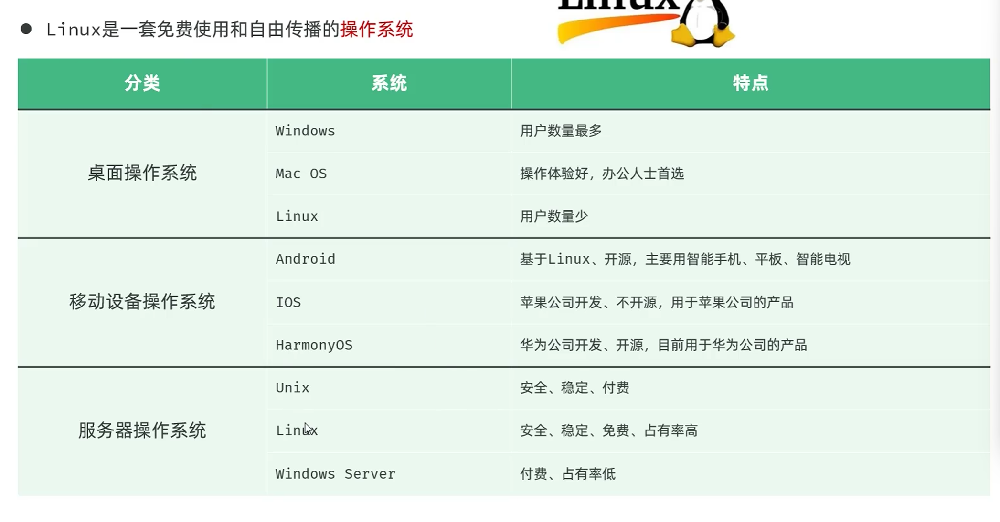
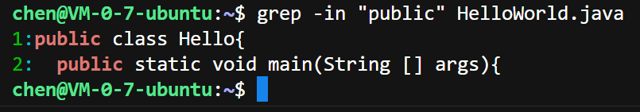

## Linux系统

Linux免费使用，自由传播，




### 目录操作命令

#### 1. `ls [-al] [dir]` 命令

作用：显示指定目录下的内容

`-a`表示显示所有文件和目录，同时将隐藏的文件或者目录也会列出来，隐藏的文件或目录一般都是以`.`开头的。

`-l`选项表示除了将文件名称列出来，还会列出文件类型（d表示目录，-表示文件），上操作时间，权限，拥有者等等，如果要详细列出就选择`-l`选项

`ll`命令可以详细列出所有详细的目录和文件，包括隐藏的，而且书写简单，是系统内置的一个别名，相当于

```bash
chen@VM-0-7-ubuntu:~$ ll
total 24
drwxr-x--- 2 chen chen 4096 Apr 15 13:56 ./
drwxr-xr-x 5 root root 4096 Apr 15 13:20 ../
-rw------- 1 chen chen  422 Apr 15 13:56 .bash_history
-rw-r--r-- 1 chen chen  220 Apr 15 13:20 .bash_logout
-rw-r--r-- 1 chen chen 3771 Apr 15 13:20 .bashrc
-rw-r--r-- 1 chen chen  807 Apr 15 13:20 .profile
chen@VM-0-7-ubuntu:~$
```

`ls -alF`,可以使用 `alias `来临时创建一个别名或者来查看一个命令当前已经设置好的别名

比如使用`alias ll`命令来获得输出`alias ll='ls -alF'`

#### 2.`mkdir [-p] dirName`

作用：创建一个目录

`-p`: 确保目录存在，如果不存在的话就会创建一个，如果不加这个选项，就不能创建多级目录（因为父目录还没有创建，所有子目录也创建不了）

#### 3.`cd [dirName]`

`.`: 表示目录当前所在的目录

`..`:表示当前目录的上一级目录

`~`: 表示用户的home目录

`/`：表示Linux的根目录

例如：

```bash
cd ..			#切换到上一级目录
cd .			#切换到当前目录
cd ~     		#切换到用户的home目录
cd /usr/local   #切换到/usr/local目录
cd - 			#切换到上一次所在的目录
```

#### 4.`rm [-rf] name`

作用：删除目录或者文件

`-r`:  表示将当前目录及其目录中的所有文件都逐一删除，即递归删除

`-f`：表示将当前目录不经过确认，直接删除

`-ri`：表示将当前目录下的所有文件都逐一删除，且要经过逐一确认


### 文件操作命令

#### 1.`cat [-n] fileName`

作用：查看文件内容

`-n`:表示查看文件的同时显示行号，适合查看一些小文件，大文件会刷屏，不适合查看。


#### 2.`more fileName`

作用：分页查看文件内容

可以查看一些比较大的文件，在查看的时候按`B`可以看上一页的内容，按空格可以查看下一页的信息，按回车可以逐行查看信息

如果要退出，则可以按`q`或者`Ctrl+C`退出。


#### 3.`head [-n] fileName`

作用：查看文件的前几行信息

`-n`:加上-n之后表示要查看文件头部的n行信息，不加默认输出10行


#### 4.`tail [-nf] fileName`

作用：查看文件尾部的后几行信息

`-n`：查看文件尾部的后n行信息

`-f`:  用于动态地查看文件尾部实时追加的信息（多用于查看日志文件）


### 拷贝移动命令

#### 1.`cp [-r] source dest`

作用:  将`source` 拷贝到 `dest`

`-r`:表示要拷贝的`source`是目录时（非文件时使用）

拷贝的目的地`dest`可以是新文件名，也可以是目录名

#### 2. `mv source dest`

作用：将`source`移动到`dest`或者重命名

重命名：当dest是一个当前目录下不存在的文件或者目录时，就是重命名

移动：当dest是一个当前目录下已存在的目录时，就是移动到这个目录下。


### 打包和压缩命令

#### `tar [-zxcvf] fileName [files]`

作用：对文件进行打包、解包、压缩、解压

包文件后缀为`.tar`表示只是完成了打包，并没有压缩

包文件后缀为`.tar·gz`表示打包的同时还进行了压缩

* -z：z代表的是gzip，通过gzip命令处理文件，gzip可以对文件压缩或者解压
* -c：c代表的是create，即创建新的包文件（打包）
* -x：x代表的是extract，实现从包文件中还原文件(解包)
* -v：v代表的是verbose，显示命令的执行过程
* -f：f代表的是file，用于指定包文件的名称

其中`-x`和`-c`命令互斥，不能同时使用

### 查找命令

`grep [inAB] word fileName`

作用：从指定文件中查找指定的文本内容（根据word关键字）

* `-i`检索的关键字忽略（ignore）大小写，可以查java，也能查Java
* `-n`显示关键字所在这一行的行号
* `-A`输出关键字所在行及之后（After）的几行记录（-A5 表示输出关键字所在行后面的5行内容）
* `-B`输出关键字所在行及之前（Before）的几行记录（-B5表示输出关键字所在行前面的5行内容）

例如：



其中后面的文件也可以支持模糊查询，比如`HelloWorld.java`文件可以写成`*.java`这样就可以支持在所有java文件中寻找该`public`关键字了


`find dirname -option fileName`

例如:  `find . -name "*.log"`就可以查询当前目录下的所有.log结尾的日志文件

