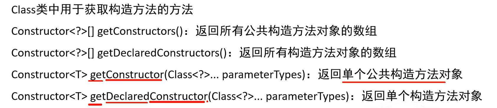
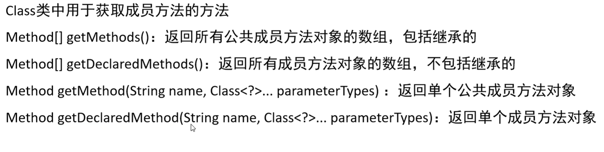

## 反射

**反射的概念：**反射允许对成员变量，成员方法，构造方法的信息进行编程访问

作用：

1. 可以获取任意一个类中所有的信息 

2. 结合配置文件动态创建对象


> 反射是 Java 中的一个强大特性，它允许在运行时检查和操作**类、字段、方法、接口**。反射是 Java 的核心组件，支持各种框架和库的实现，如 Spring、Hibernate 等。使用反射，可以在**运行时动态地创建对象**、调用方法和访问字段，而无需在编译时了解这些对象的具体实现。


**反射的缺点:**    

* 破坏封装: 由于反射允许访问私有字段和私有方法,所有可能会破坏封装而导致安全问题
* 性能开销: 由于反射涉及到动态解析， 因此无法执行Java虚拟机优化，再加上反射的写法复杂得多，所以性能相比于直接获取类差很多，所有在一些性能敏感的程序中应该避免使用反射


**三种获取class对象的方法：**

1. `Class.forName()`,参数为反射类的完全限定名（包名+类名），适用于类加载阶段。编译后已经生成了`.class`字节码文件，但还没有加载到内存中。其动态性最强。
2. `类名.class`，适用于源代码阶段，在写代码时就已经明确知道要操作哪个类，其最安全，性能最高
3. `对象.getClass()`，适用于运行阶段，此时程序已经在内存中创建了该类的实例，属于`object`类的方法，所有Java对象都有。


来看一个反射的例子：

```java
 public static void main(String[] args) throws ClassNotFoundException, NoSuchMethodException,
            InvocationTargetException, InstantiationException, IllegalAccessException {
                
        //获取class对象       
        Class clazz = Class.forName("reflection.Student");
        System.out.println(clazz);
                
        //获取构造方法
        Constructor constructor = clazz.getConstructor();
                
        //获取class对应的实例对象
        Object object = constructor.newInstance();
                
        //获取对应的成员方法
        Method setNameMethod = clazz.getMethod("setName", String.class);
        Method getNameMethod = clazz.getMethod("getName");
                
        //调用获取出来的方法
        setNameMethod.invoke(object,"zhangsan");
        System.out.println(getNameMethod.invoke(object));

    }
```


**利用反射获取构造方法**：



有`Declared`的方法权限更大，可以获取私有的构造方法

`getConstructors()`:返回一个构造方法类型的数组

```java
Class clazz = Class.forName("reflection.Student");
        //获取构造方法
        Constructor[] constructors = clazz.getConstructors();
        for (Constructor constructor : constructors) {
            System.out.println(constructor);
        }
		//output: public reflection.Student()
        //        public reflection.Student(java.lang.String,int)
```

`getDeclaredConstructors()`与`getConstructors()`相类似，只是权限更大，可以获取由`private`关键字修饰的构造方法

`getDeclaredConstructor()`与上述例子中类似，只能获取单个构造方法对象，也可以获取由`private`关键字修饰的构造方法


**利用反射获取权限修饰符：**

```java
		//获取权限修饰符
		int modifiers = constructor.getModifiers;
		System.out.println(modifiers);
```


**利用反射获取参数:**

```java
		//获取参数
        Parameter[] parameters = constructor.getParameters();
        for (Parameter parameter : parameters) {
            System.out.println(parameter);
        }

		//获取参数个数
        int parameterCount = constructor.getParameterCount();
		System.out.println(parameterCount);

		//获取参数类型
        Class[] parameterTypes = constructor.getParameterTypes();
        for (Class parameterType : parameterTypes) {
            System.out.println(parameterType);
        }
```


**利用反射获取实例对象：**

```java
		//获取class对应的实例对象
		Object object = constructor.newInstance("zhangsan",23);
```

注意：若该构造方法是被`private`或者`protected`修饰的，则不能直接创建对象，应该先取消权限校验：

```java
		//临时取消权限校验		
 		construct.setAccessible(true);
```


**利用反射获取成员变量:**

```java
//获取成员变量
        //获取公共的成员变量
        Field[] fields = clazz.getFields();
        for (Field field : fields) {
            System.out.println(field);
        }
		//output: public java.lang.String reflection.Student.gender

        //获取所有成员变量
        Field[] declaredFields = clazz.getDeclaredFields();
        for (Field declaredField : declaredFields) {
            System.out.println(declaredField);
            	/*output:   private java.lang.String reflection.Student.name
							private int reflection.Student.age
							public java.lang.String reflection.Student.gender*/
             }
        //获取单个的公共的成员变量
        Field gender = clazz.getField("gender");
        System.out.println(gender);  
			//output:  public java.lang.String reflection.Student.gender

        //获取单个的任何权限的成员变量
        Field name = clazz.getDeclaredField("name");
        System.out.println(name);  
			//output:private java.lang.String reflection.Student.name

		//获取成员变量对应的值
		Student stu =new Student("zhangsan",23,"男");
        //临时取消权限校验
        name.setAccessible(true);
        Object value = name.get(stu);
        System.out.println(value); //output : zhangsan
```


利用反射获取成员方法：



```java
//获取指定的单一方法
        //eat方法被private修饰，所有要使用getDeclaredMethod,传递方法的名字和方法的形参
        Method method = clazz.getDeclaredMethod("eat", String.class);

        //获取方法的修饰符
        int modifiers = method.getModifiers();
        System.out.println(modifiers);

        //获取方法的名字
        String name = method.getName();
        System.out.println(name);

        //获取方法的参数
        Parameter[] parameters = method.getParameters();
        for (Parameter parameter : parameters) {
            System.out.println(parameter);
        }

        //获取方法抛出的异常
        Class[] exceptionTypes = method.getExceptionTypes();
        for (Class exceptionType : exceptionTypes) {
            System.out.println(exceptionType);
        }

        //方法调用
        Student stu =new Student("zhangsan",24,"男");
        method.setAccessible(true);
        String result = (String) method.invoke(stu, "汉堡包");
        System.out.println(result);
```

