# JavaWeb

[toc]


## Maven

Maven 是一款**apache**旗下开源项目，用来**管理和构建Java项目**的工具

### Mavn的作用

Maven的作用:

* **依赖管理：**方便快捷地管理项目所依赖的资源（jar包），只需要在配置文件中添加所需要的jar包名，即可自动引入jar包，想要更换版本，也只需要在.pom配置文件中更改即可

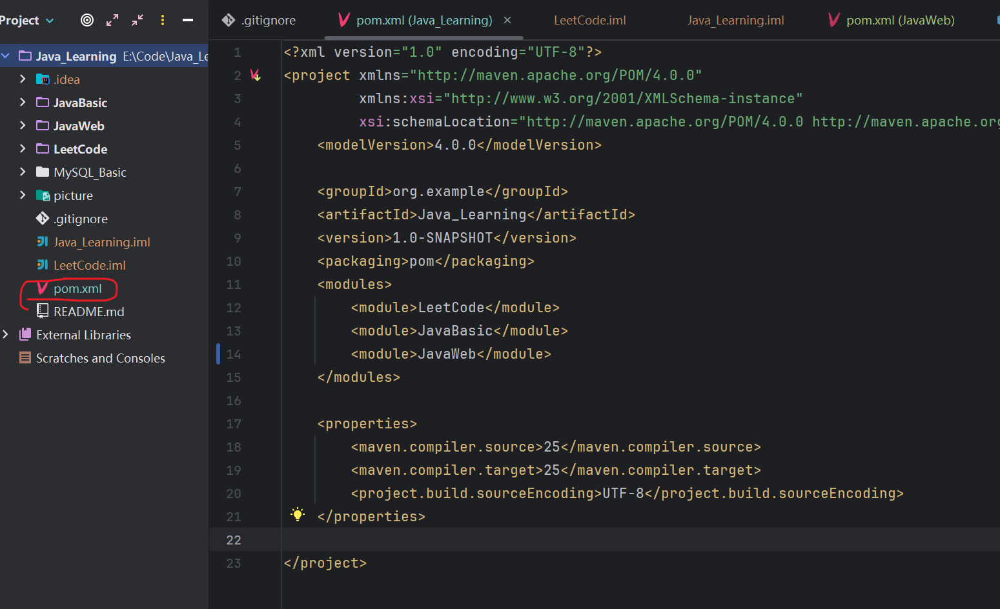

* **标准的项目构建流程：**提供了一套标准的项目构建流程（跨平台），可以一键完成项目的编译，测试，打包以及发布等操作

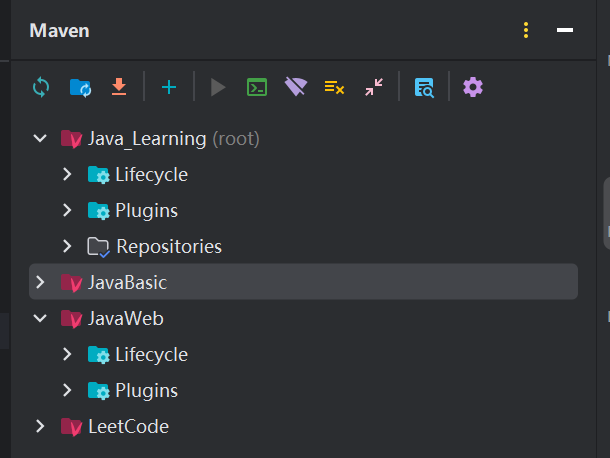

* **统一的项目结构：**在所有的项目工具中都通用，如果在一个工具中构建，在另一个工具中也可以直接使用，降低了项目开发，维护以及管理的成本

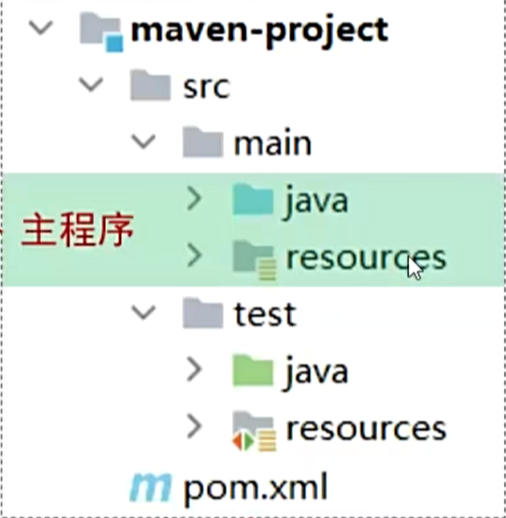

可以总结为一句话：**“规范目录结构、自动化导包、一站式项目构建”**

### 关于pom.xml文件

每个Maven构建的项目中都有一个`pom.xml`配置文件，基于**项目对象模型**（POM）的概念，通过一小段的描述信息来管理项目的构建，POM是`Project Object Model`（项目对象模型）的简称，这个.xml文件还会根据**依赖管理模型**（Dependency）来配置一些跟依赖相关的文件。

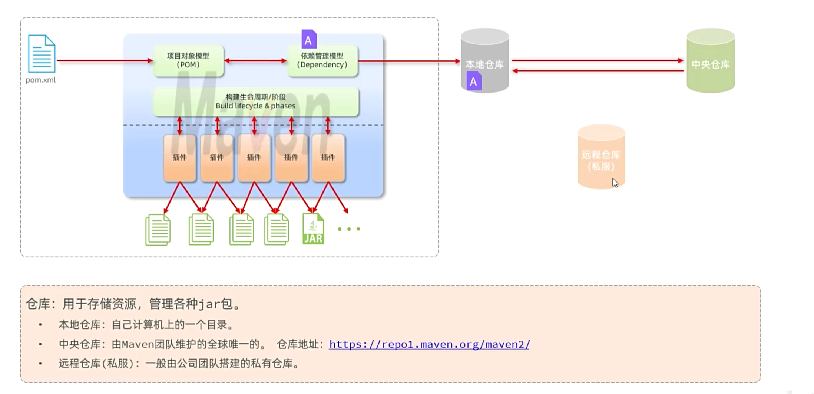

依赖的资源会去本地仓库中寻找，如果依赖的资源在本地仓库（自己计算机上的目录）中不存在，则会去中央仓库下载对应的资源到本地仓库，然后直接关联本地仓库的资源；

如果有远程仓库（私服），一般是公司团队内部自己搭建的一个仓库，里面存放自己公司所依赖的一些资源，如果在本地仓库中找不到所依赖的资源，则会优先到远程仓库去寻找，如果远程仓库中也没有，那么远程仓库会去中央仓库下载该资源到远程仓库，然后本地仓库再从远程仓库中下载该资源，以此来关联项目中的依赖。

### Maven的安装

方式一：官网安装：参考黑马的教程

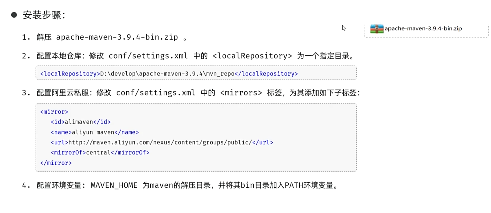


方式二：由于IDEA中内置了Maven，所以不需要从官网去重新下载，但是要更改IDEA中的一些配置，以下为Gemini为我指导的配置步骤：

> ### 第一步：准备“仓库”和“配置文件”
>
> 1. 在 **D 盘**（或者非系统盘）新建一个文件夹，命名为 `maven_workspace`。
> 2. 在 `maven_work` 文件夹里再建一个子文件夹，叫 `repository`（这就是你未来的本地仓库）。
> 3. 在 `maven_work` 里新建一个文本文档，改名为 **`settings.xml`**（注意后缀名要从 `.txt` 改成 `.xml`）。
>
> ------
>
> ### 第二步：配置阿里云镜像（核心代码）
>
> 用记事本打开刚才新建的 `settings.xml`，把下面的代码全部复制进去并保存。这段代码已经帮你配好了**本地仓库路径**和**阿里云下载加速**：
>
> XML
>
> ```
> <?xml version="1.0" encoding="UTF-8"?>
> <settings xmlns="http://maven.apache.org/SETTINGS/1.0.0"
>           xmlns:xsi="http://www.w3.org/2001/XMLSchema-instance"
>           xsi:schemaLocation="http://maven.apache.org/SETTINGS/1.0.0 http://maven.apache.org/xsd/settings-1.0.0.xsd">
> 
>     <localRepository>D:\maven_work\repository</localRepository>
> 
>     <mirrors>
>         <mirror>
>             <id>alimaven</id>
>             <name>aliyun maven</name>
>             <url>http://maven.aliyun.com/nexus/content/groups/public/</url>
>             <mirrorOf>central</mirrorOf>
>         </mirror>
>     </mirrors>
> </settings>
> ```
>
> > **注意**：如果你的路径不是 `D:\maven_work\repository`，记得修改 `<localRepository>` 标签里的内容。
>
> ------
>
> ### 第三步：在 IDEA 中“强绑定”
>
> 这是最关键的一步，决定了 IDEA 会不会听你的话：
>
> 1. 打开 IDEA，点击 **`File` -> `Settings`** (Mac 用户是 `IntelliJ IDEA` -> `Settings`)。
> 2. 依次进入：**`Build, Execution, Deployment` -> `Build Tools` -> `Maven`**。
> 3. 修改以下三个地方（参考下图逻辑）：
>    * **Maven home path**: 选 `Bundled (Maven 3)`。
>    * **User settings file**: 勾选右边的 `Override`，点击文件夹图标，选择你刚才在 **D 盘建的那个 `settings.xml`**。
>    * **Local repository**: 勾选 `Override`，它通常会自动识别成你 `settings.xml` 里写的路径，如果没有，就手动选到 **D 盘的 `repository` 文件夹**。
>
> ------
>
> ### 第四步：一劳永逸（针对新项目）
>
> 上面的配置只对当前项目生效。为了让你以后新建项目不用重复配置，请点击：
>
> * **`File` -> `New Projects Setup` -> `Settings for New Projects...`**
> * 重复一遍上面的 **第三步**。这样你以后建任何 JavaWeb 项目，默认都是这个起飞速度！


好处一：默认情况下，Maven 下载的所有 jar 包都会塞进 `C:\Users\用户名\.m2\repository`，这样的话可以避免C盘被撑爆。

好处二：IDEA本身默认会从国外的服务器去下载对应的jar包，下载速度很慢，但是更改为阿里云的镜像之后可以，速度可以快很多。


### Maven坐标

主要分为三个部分：

* `groupID`:组织名称（通常为域名）
* `artifactID`：模块名称
* `version`：版本号
  * `SNAPSHOT`:快照版本，功能不稳定，尚处于开发阶段
  * `RELEASE`:可用于发行的版本,  功能趋于稳定,当前更新停止

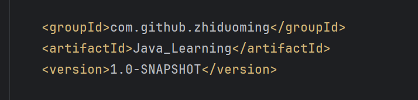

### 导入Maven项目:

* 建议将导入的文件先复制到自己的项目目录下

* 建议选择Maven项目的pom.xml文件进行导入

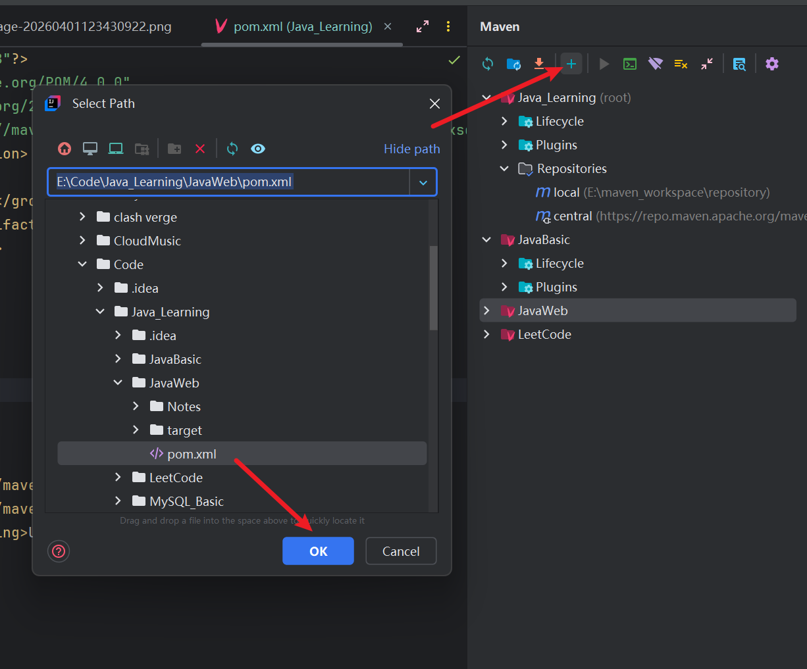

### 配置依赖

格式如下：

```xml
<dependencies>
        <dependency>
            <groupId>examplegroup</groupId>
            <artifactId>exampleID</artifactId>
            <version>exampleversion</version>
        </dependency>
    </dependencies>
```

如果导入的依赖有其他依赖，则称为**依赖传递**，该依赖也会引入它的依赖，如果我们不需要某个子依赖，则可以通过<exclusions>...<exclusions>将其排除掉，成为**排除依赖**

注意事项：

* 一旦依赖配置变更了，要重新加载
* 如果引入的依赖本地仓库不存在，则需要联网


### 生命周期（lifecycle）

生命周期就是对Maven项目构建的过程进行的抽象统一

Maven有3套生命周期，分别是clean，default，site

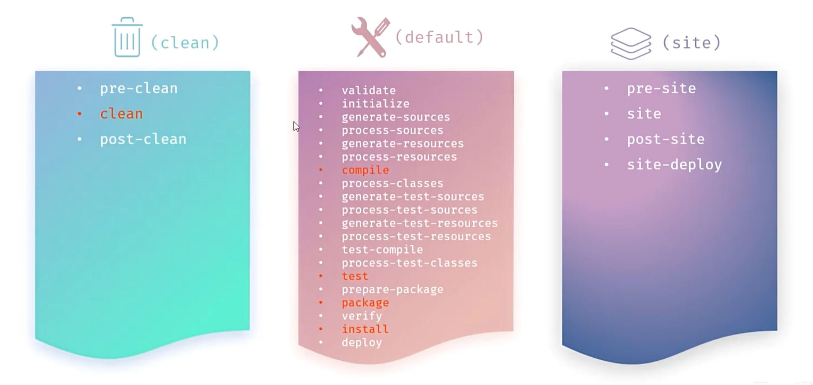

每套生命周期包含一些阶段（phase），阶段是有顺序的，后面的阶段依赖于前面的阶段。

我们只关注其中的5个阶段

* `clean`:移除上一次构建生成的文件
* `compile`：编译项目源代码
* `test`：使用合适的单元测试框架运行测试（junit）
* `package`：将编译后的文件打包，如：jar，war等
* `install`：安装项目到本地仓库

注意：在==同一套==生命走起中，当运行后面的生命周期时，前面的生命周期都会运行


### 单元测试

测试：是一种用来促进鉴定软件正确性，完整性，安全性和质量的过程

阶段：**单元测试、集成测试、系统测试、验收测试**

测试方法：**白盒测试、黑盒测试、灰盒测试**

其中单元测试是白盒测试，集成测试是灰盒测试，系统测试和验收测试是黑盒测试

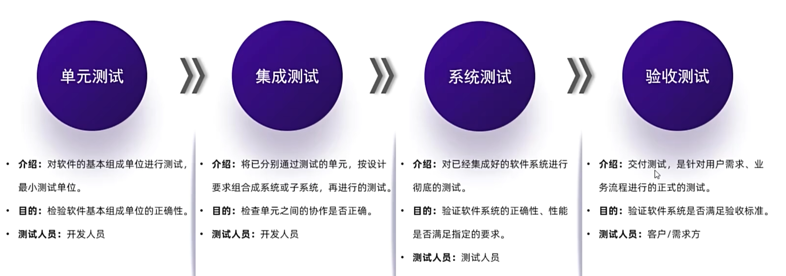


**单元测试**：**针对最小的功能单元（方法）**，编写测试代码对其正确性进行测试

`JUnit`:最流行的Java单元测试框架，提供了一些功能，方便程序进行单元测试（第三方公司提供）

和普通的main方法测试，`JUnit`单元测试有很多优势：

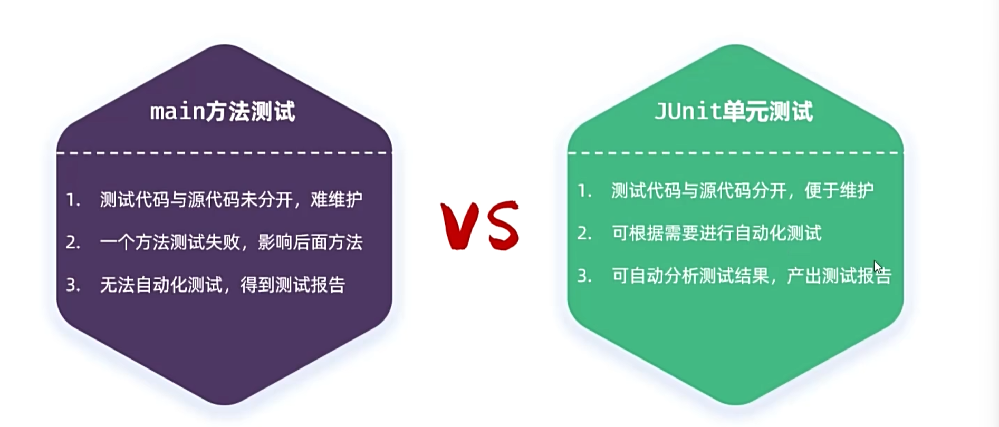

具体操作：

创建一个.java文件，其中文件的名称规范为==test+原文件名称==，在里面书写各种测试方法，每个测试方法的命名规范同文件名的命名规范，均为：==test+方法名==，然后要在方法上面==加上@Test注解==，这样才能表示为使用JUnit进行测试，方法的修饰符==必须为==`public void`。

在JUnit中还提供了一些注解来增强其功能：

| 注解                 | 说明                                                         | 备注                                |
| :------------------- | :----------------------------------------------------------- | :---------------------------------- |
| `@Test`              | 测试类中的方法用它修饰才能成为测试方法，才能启动执行         | 单元测试                            |
| `@ParameterizedTest` | 参数化测试的注解（可以让单个测试运行多次，每次运行时仅参数不同） | **用了该注解，就不需要@Test注解了** |
| `@ValueSource`       | 参数化测试的参数来源，赋予测试方法参数                       | 与参数化测试注解配合使用            |
| `@DisplayName`       | 指定测试类、测试方法显示的名称（默认为类名、方法名）         |                                     |
| `@BeforeEach`        | 用来修饰一个实例方法，该方法会在**每一个**测试方法执行之前执行一次。 | 初始化资源(准备工作)                |
| `@AfterEach`         | 用来修饰一个实例方法，该方法会在**每一个**测试方法执行之后执行一次。 | 释放资源(清理工作)                  |
| `@BeforeAll`         | 用来修饰一个静态方法，该方法会在所有测试方法之前**只执行一次**。 | 初始化资源(准备工作)                |
| `@AfterAll`          | 用来修饰一个静态方法，该方法会在所有测试方法之后**只执行一次**。 | 释放资源(清理工作)                  |

现在有了AI之后可以直接让AI去生成对应的单元测试代码，不用我们手动去写了，当然AI写的不一定正确，一定要检查

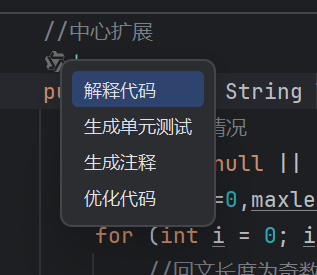

### Maven的依赖范围

在默认情况下，依赖的jar包可以在任意地方进行使用（主程序main下），当我们想要指定其作用范围，可以使用<scope>...</scope>来进行指定，可以有4种依赖范围：

| **范围 (Scope)**   | **编译 (Compile)** | **测试 (Test)** | **运行 (Runtime)** | **是否打包 (Package)** | **典型例子**                |
| ------------------ | ------------------ | --------------- | ------------------ | ---------------------- | --------------------------- |
| **compile** (默认) | ✅                  | ✅               | ✅                  | ✅                      | `MyBatis`, `Log4j`          |
| **test**           | ❌                  | ✅               | ❌                  | ❌                      | `JUnit`                     |
| **provided**       | ✅                  | ✅               | ❌                  | ❌                      | `Servlet-API`, `Lombok`     |
| **runtime**        | ❌                  | ❌               | ✅                  | ✅                      | `JDBC 驱动实现类`           |
| **system**         | ✅                  | ✅               | ❌                  | ❌                      | 本地某个路径的 jar (不推荐) |
| **import**         | -                  | -               | -                  | -                      | 用于 `dependencyManagement` |

## JavaWeb基础

### 静态资源与动态资源：

📁 **静态资源（Static Resources）**

定义

**不需要服务器端处理**，直接原样返回给客户端的文件。

**特点**

* ✅ **内容固定** - 无论谁访问、什么时候访问，内容都一样
* ✅ **可直接缓存** - 浏览器/CDN 可以缓存，提高访问速度
* ✅ **无服务器计算** - 服务器只是"读取文件 → 发送给客户端"

**常见类型**

| 类型           | 文件扩展名                     | 作用     |
| -------------- | ------------------------------ | -------- |
| **HTML**       | `.html`, `.htm`                | 网页结构 |
| **CSS**        | `.css`                         | 样式美化 |
| **JavaScript** | `.js`                          | 前端交互 |
| **图片**       | `.jpg`, `.png`, `.gif`, `.svg` | 视觉内容 |
| **字体**       | `.ttf`, `.woff`, `.woff2`      | 字体文件 |
| **视频/音频**  | `.mp4`, `.mp3`, `.webm`        | 多媒体   |
| **文档**       | `.pdf`, `.txt`                 | 下载文件 |

🔄 **动态资源（Dynamic Resources）**

**定义**

**需要服务器端处理**，根据请求参数、用户身份、数据库状态等**动态生成内容**。

**特点**

* 🔄 **内容变化** - 不同用户看到不同内容
* ⚡ **实时计算** - 每次请求都可能需要查询数据库、处理业务逻辑
* 🔐 **用户相关** - 通常需要用户认证、权限检查

**常见类型**

| 类型           | 技术                  | 特点                         |
| -------------- | --------------------- | ---------------------------- |
| **Servlet**    | Java Servlet          | JavaWeb 核心，处理 HTTP 请求 |
| **JSP**        | JavaServer Pages      | 在 HTML 中嵌入 Java 代码     |
| **Spring MVC** | `@Controller`         | 现代 JavaWeb 主流框架        |
| **REST API**   | `@RestController`     | 返回 JSON/XML 数据           |
| **模板引擎**   | Thymeleaf, FreeMarker | 动态生成 HTML                |

### B/S架构

B/S架构，即**Browser/Server**，浏览器/服务器架构模式。只需要浏览器，应用程序的逻辑和数据都存储在服务器端

（维护方便，但是体验一般，会受到网络等条件的限制）

### C/S架构

C/S架构，即**Client/Server**，客户端/服务器架构模式。需要单独开发和维护客户端。（体验不错，但是开发维护比较吗麻烦，要不断更新）

### springboot入门

Spring官网的说明

> Whatever you're building, these guides are designed to get you productive as quickly as possible – using the latest Spring project releases and techniques as recommended by the Spring team.

Springboot的特点

> Features
> • Create stand-alone Spring applications
> • Embed Tomcat, Jetty or Undertow directly (no need to deploy WAR files)
> • Provide opinionated 'starter' dependencies to simplify your build configuration
> • Automatically configure Spring and 3rd party libraries whenever possible
> • Provide production-ready features such as metrics, health checks, and externalized configuration
> • Absolutely no code generation and no requirement for XML configuration

创建第一个springboot项目

在IDEA中创建第一个springboot项目,  创建时选择Maven,  设置好groupID,  ArtifactID,  然后

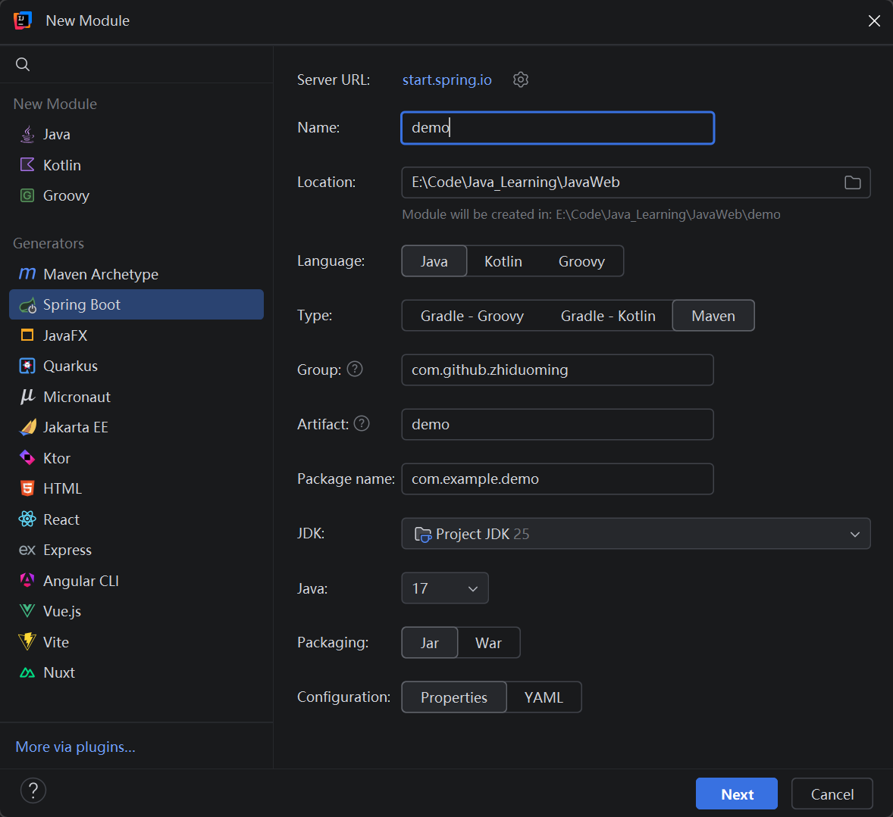

然后选择所需要的依赖:

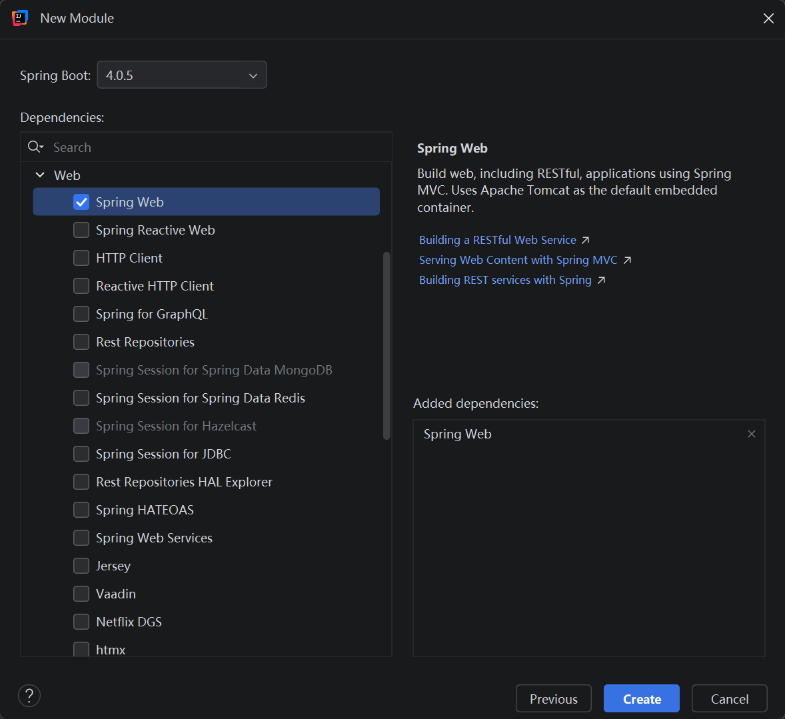

选择一个依赖后,  由于依赖的传递性,  会自动配置好其他相关的依赖

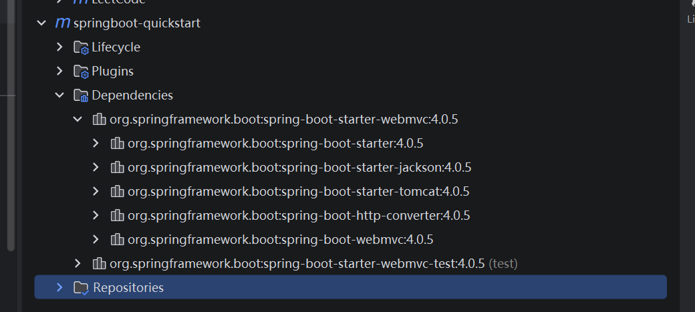

创建完毕之后,  项目中会自动生成一个启动类(引导类),  专门用来启动当前项目  

os:  在创建完毕之后,  我第一次尝试的过程中发现无法创建Java类,  之后尝试点击右边的Maven图标,  然后手动将创建的项目导入进来之后,  这个项目才算是真正地添加进来了,  要不然根目录下的.xml文件无法解析当前创建的项目

然后在项目中创建了一个请求处理类,  即先创建一个类,  然后在这个类的上面加上注解`@RestController`,  这样这个类才能被真正地被识别为请求处理类

```java
@RestController//表示当前类是一个请求处理类
public class HellowController {
    @RequestMapping("/hello")
    public String hello(String name) {
        System.out.println("name:" + name);
        return "Hello" + name + "~";
    }
```

然后在里面创建请求处理方法,  方法需要加上注解`@RequestMapping`,  后面跟上请求路径

> **`@RestController`**：
>
> * 它是 `@Controller` 和 `@ResponseBody` 的合体。
> * 作用：告诉 Spring，“我这个类是专门接客（处理请求）的，而且我返回的字符串请直接丢给浏览器看，别去帮我找什么网页模板了”。
>
> **`@RequestMapping("/hello")`**：
>
> * 这就是**路由映射**。它告诉 Spring，“如果有人访问 `/hello` 这个路径，就派这个方法去接待”。

**可能遇到的问题**

在创建项目的时候， 我们是基于spring官方提供的骨架来创建的，如果这个spring官方的骨架由于网络等原因出现连接超时连接不上，则可以将`ServerURL`从`start.spring.io`换为`start.aliyun.com`

### HTTP协议：

**基本概念：** **Hyper  Text Transfer  Protocol** ，超文本传输协议，规定了客户端（浏览器）和服务器之间数据传输的规则。

**特点：**

1.  基于TCP协议：面向连接，安全
2. 基于请求-响应模型：一次请求对应一次响应
3. HTTP协议是无状态的协议：对于事务处理没有记忆能力，每次请求-响应都是独立的
   * 缺点：多次请求间不能共享数据
   * 优点：速度快


#### HTTP请求（Request）

**组成部分：**

* **请求行：**请求数据的第一行（请求方式，资源路径，协议）

* **请求头：**第二行开始，格式：key：value
* 空行：分隔头部和主体

* **请求体（可选）：**对于POST请求，存放请求参数

有两种请求方式：

`GET`：请求参数包含在请求行中，没有请求体，请求大小在浏览器中受到限制

`POST`：请求参数存放在请求体中，没有请求大小的限制

例如：

```http

GET /hello?name=zhangsan&age=23 HTTP/1.1  <-请求行（请求方式，资源路径，协议）

Accept: text/html,application/xhtml+xml,application/xml;q=0.9,image/avif,image/webp,image/apng,*/*;q=0.8,application/signed-exchange;v=b3;q=0.7
Accept-Encoding: gzip, deflate, br, zstd
Accept-Language: zh-CN,zh;q=0.9
Cache-Control: max-age=0
Connection: keep-alive
Host: localhost:8080				<-请求头（键值对）
Sec-Fetch-Dest: document
Sec-Fetch-Mode: navigate
Sec-Fetch-Site: cross-site
Sec-Fetch-User: ?1
Upgrade-Insecure-Requests: 1
User-Agent: Mozilla/5.0 (Windows NT 10.0; Win64; x64) AppleWebKit/537.36 (KHTML, like Gecko) Chrome/146.0.0.0 Safari/537.36
sec-ch-ua: "Chromium";v="146", "Not-A.Brand";v="24", "Google Chrome";v="146"
sec-ch-ua-mobile: ?0
sec-ch-ua-platform: "Windows"
								<-无请求体
```


#### HTTP响应（Response）

组成部分：

* **状态行：**第一行，包含协议，HTTP状态码，状态描述

* **响应头：**key：value键值对

* **空行：**分割头部和主体

* **响应体：**返回的数据内容

例如：

```
HTTP/1.1 200		<-状态行（响应行）

Content-Type: text/html;charset=UTF-8
Content-Length: 14
Date: Thu, 09 Apr 2026 16:55:08 GMT			<-响应头
Keep-Alive: timeout=60
Connection: keep-alive
							<-空行
Hellozhangsan~		<-响应体
```

#### 响应状态码

| **状态码** | **类别**         | **含义**                               | **常见例子与说明**                                           |
| ---------- | ---------------- | -------------------------------------- | ------------------------------------------------------------ |
| **1xx**    | **信息性状态码** | 服务器收到请求，需要请求者继续执行操作 | `101 Switching Protocols`（切换协议，如 WebSocket）          |
| **2xx**    | **成功状态码**   | 请求已成功被服务器接收、理解、并接受   | **`200 OK`**（最常见，请求成功） `201 Created`（已创建，常用于 POST 成功） |
| **3xx**    | **重定向状态码** | 需要客户端采取进一步操作以完成请求     | `301 Moved Permanently`（永久重定向） `302 Found`（临时重定向） |
| **4xx**    | **客户端错误**   | 请求包含语法错误或无法完成请求         | **`400 Bad Request`**（请求参数有误） **`401 Unauthorized`**（未授权/未登录） **`403 Forbidden`**（有权限但被禁止访问） **`404 Not Found`**（接口路径写错了，没找到资源） |
| **5xx**    | **服务器错误**   | 服务器在处理请求的过程中发生了错误     | **`500 Internal Server Error`**（Java 代码抛异常没捕获） `502 Bad Gateway`（网关错误） `503 Service Unavailable`（服务器过载或停机维护） |

#### HTTP方法

| 方法        | 作用         | 幂等性   | 安全性   |
| ----------- | ------------ | -------- | -------- |
| **GET**     | 获取资源     | ✅ 幂等   | ✅ 安全   |
| **POST**    | 创建资源     | ❌ 不幂等 | ❌ 不安全 |
| **PUT**     | 更新资源     | ✅ 幂等   | ❌ 不安全 |
| **DELETE**  | 删除资源     | ✅ 幂等   | ❌ 不安全 |
| **PATCH**   | 部分更新     | ❌ 不幂等 | ❌ 不安全 |
| **HEAD**    | 获取头部     | ✅ 幂等   | ✅ 安全   |
| **OPTIONS** | 查询支持方法 | ✅ 幂等   | ✅ 安全   |

**关键概念**：

* **幂等性**：多次执行结果相同（GET/PUT/DELETE）
* **安全性**：不修改服务器资源（GET/HEAD/OPTIONS）

#### Web服务器的自动封装

在HTTP请求数据和响应数据时，都不需要程序员自己设置，其中web服务器对HTTP请求数据和响应数据都进行了封装

（`HttpServletRequest`和`HttpServletResponse`）我们只需要操作这两个类即可，每个类中都已设定了对应的方法，可以用AI来辅助我们生成需要的代码，格式是固定的

```java
//请求类
@RestController
public class RequestController {

    @RequestMapping("/request")
    public String request(HttpServletRequest request) {
        
        //1.获取请求方式
        String method = request.getMethod();
        System.out.println("请求方式："+method);
        
        //2.获取请求URL地址
        String urrequest.getRequestURL().toString();//http://localhost:8080/springboot-quickstart/request
        System.out.println("请求URL地址："+url);
        
        //3.获取请求URI
        String uri = request.getRequestURI();
        System.out.println("请求URI："+uri);
        
        //4.获取请求协议
        String protocol = request.getProtocol();
        System.out.println("请求协议："+protocol);
        
        //5.获取请求参数 ?name=zhangsan,age=23
        String name = request.getParameter("name");
        String age = request.getParameter("age");
        System.out.println("请求参数：name="+name+",age="+age);

        //6.获取请求头
        String header = request.getHeader("Accept");
        System.out.println("请求头："+header);
        
        return "请求成功";
    }
```

```java
//响应类
@RestController
public class ResponseController {

    @RequestMapping("/response")
    public void response(HttpServletResponse  response) throws IOException {
        //1.设置响应状态码
        response.setStatus(200);
        //2.设置响应头
        response.setHeader("name", "zhangsan");
        //3.设置响应体
        response.getWriter().write("<h1>Hello Response</h1>");
    }

    @RequestMapping("/response2")
    public ResponseEntity<String> response2() {
        return ResponseEntity
                .status(HttpStatus.OK)
                .header("name", "zhangsan")
                .body("<h1>Hello Response2</h1>");
    }
}

```

注意：在`HttpServletResponse`中，一般情况下**不需要**我们手动设置状态码和响应头，服务器会根据请求逻辑**自动生成**

## Mybatis

### Mybatis相对于JDBC的提升

> 1. 开发效率更高：不用手写大量 Connection/PreparedStatement/ResultSet 模板代码。
> 2. SQL 与 Java 解耦：SQL 写在 Mapper XML 或注解里，维护更清晰。
> 3. 自动对象映射：查询结果可直接映射成 Java 对象（resultMap），少写手动 set。
> 4. 参数处理更安全：#{} 自动做预编译参数绑定，减少 SQL 注入风险。
> 5. 动态 SQL 更强：if/where/trim/foreach 等标签方便拼复杂条件。
> 6. 事务整合更好：和 Spring/Spring Boot 配合后，事务管理比纯 JDBC 顺滑很多。
> 7. 缓存能力：内置一级缓存、可选二级缓存，减少重复查询。
> 8. 插件扩展：可做分页、审计、性能统计等拦截扩展。

一句话：JDBC 更底层、可控但繁琐；MyBatis 在保留 SQL 可控性的同时，大幅降低了数据库层开发成本。

### Mybatis的数据库连接配置：

需要在`application.properties`文件中定义如下配置

```properties
#项目名称
spring.application.name=springboot-Mybatis-demo01
#数据库的url
spring.datasource.url=jdbc:mysql://localhost:3306/web01
#数据库驱动
spring.datasource.driver-class-name=com.mysql.cj.jdbc.Driver
#数据库用户名
spring.datasource.username=root
#数据库密码
spring.datasource.password=password

#配置MyBatis的日志输出
mybatis.configuration.log-impl=org.apache.ibatis.logging.stdout.StdOutImpl
```

### 数据库连接池

数据库连接池是一个容器，使用了它就可以更好地来分配和管理数据库的连接。

原本每次和数据库进行连接都需要重新创建一个connection对象，在使用完之后又要去重新关闭它。但是如果是用了数据库连接池，程序在启动的时候就会在数据库连接池中初始化一些连接对象connection，然后如果要执行对应的sql语句，则会直接去拿连接池中现有的connection，sql语句执行完毕之后又会重新归还到连接池当中，如果其他客户端要去执行sql语句，则又会在连接池中获取对应的连接，用完后又归还....

连接池为了解决数据库连接遗漏问题（即数据库连接池当中的连接越用越少），当客户端拿到connection之后占用着但不执行对应的操作且不归还给连接池，则这样的connection就会处于空闲状态，为了处理这样的情况，连接池会自动释放空闲时间超过预设的最大空闲时间的连接对象connection，这样就避免了数据库连接遗漏的问题。

通过这些操作，使得数据库连接池具有这三种特性：

* 达到了连接的复用，避免了每次都要重开一个连接再关闭
* 提升了程序运行的效率，提升了系统的访问性能
* 避免了数据库连接遗漏

为了实现数据库连接池，sun公司设计了一个数据库连接池的接口：`Datasource`，然后由各个第三方组织去实现这个接口，在这个接口中定义了获取连接的方法：

```java
Connection getConnection() throws SQLException;
```

由各个第三方组织去实现该接口，同时重写里面的这个方法

目前市面上比较具有代表性的第三方组织实现的连接池有

`hikari`(Springboot默认)，`Druid`,`DBCP`,`C3P0`

如果需要切换，则需要引入对应的依赖，然后指定选用的连接池类型即可


### 基于Mybatis的增删改查操作

#### 删除操作

在定义mapper接口的时候，定义删除的方法，然后加上`@Delete()`注解，并在括号中写上对应的DML删除操作的sql，然后要注意的地方是，这个方法是有返回值的，返回值为执行该sql影响的记录数，在定义方法类型时，如果需要使用该返回值，可以将类型定义为`Integer`，也可以直接定义为`void`。

在（）中写sql语句时，例如

```java
@Delete("delete from user where id = #{id}")
public void DeleteById(Interger id);
```

使用`#{...}`，`#`是占位符，会将`#{...}`转换为`?`，避免了sql注入，生成了预编译的sql，这样提高了安全性与效率

使用`${...}`,`$`是字符串拼接符号，会直接将（）中的参数值直接拼接在sql中，会导致sql注入，不安全，效率低，不推荐

#### 增添操作

需要在Mapper接口中定义insert方法，上面加入`@Insert()`注解，然后在( )中写上对应的sql语句，注意，如果要插入的字段过多，则可以在定义方法参数时直接传递对应的对象，将需要插入的属性封装在对象当中，例如插入用户信息可以将信息封装在一个User对象当中

```java
@Insert("insert into user (username, password, name, age) values (#{username},#{password},#{name},#{age})")
    public void insert(User user);
```

然后在执行之前new一个User对象：

```java
 @Test
    public void testInsert(){
        User user =new User(null,"yangyang","123456","杨洋",28);
        userMapper.insert(user);
    }
```

#### 修改操作

很简单，没啥要注意的

```Java
    @Update("update user set username =#{username},password=#{password} ,name =#{name}, age 	=#{age} where id =#{id}")
    public void update(User user);

//调用
	@Test
    public void testUpdate(){
        User user = new User(1 ,"zhouyu" ,"123456","周瑜",20);
        userMapper.update(user);
    }
```

查询操作

要注意的是，如果是查询操作，那么就需要返回值，可以将返回值定义为一个对象，如果有多个查询结果，则可以定义为一个集合，在传递查询条件的参数时，如果我们使用的是springboot的官方骨架创建的springboot项目，那么就直接传递参数类型和参数名称，不需要使用`Param()`注解，但也可以加上，因为如果不是基于springboot官方创建的springboot项目，就必须要加上该注解，具体操作如下：

```java
@Select("select * from user where username =#{username} and password =#{password}")
    public User findByUsernameAndPassword(@Param("username")String username,@Param("password")String password);
```

`@Param()`注解括号中的参数必须和`#{...}`中传递的参数名称相同相对应

然后调用的时候使用对应的返回值类型来接收即可。


另一种方式来实现语句映射：使用xml配置文件来映射sql语句

规则：

* 我定义的xml的映射文件的名称要与Mapper这个接口的名称相同，比如我的Mapper接口叫`UserMapper`，那么我的xml文件就要命名为：`UserMapper.xml`

* xml映射文件中有个`namespace`属性，然后要让这个属性值和我的**Mapper接口的全限定名**保持一致，例如，我的包名叫做`com.github.zhiduoming.Mapper`，那么这个全限定名就为`com.github.zhiduoming.Mapper.UserMapper`

* xml映射文件中sql语句中的id要与Mapper接口中的方法名保持一致，并保持返回类型一致。例如：

  ```xml
  <select id="findAll" resultType="com.github.zhiduoming.pojo.User">
      select id, username , password , name , age from user
  </select>
  ```

  由于我的`findAll`方法的返回值是`User`，然后`User`这个类又定义在`pojo`这个包下，组织名叫`com.github.zhiduoming`所以这个`resultType`就等于`"com.github.zhiduoming.pojo.User"`

然后不同的sql语句具有不同的标签，比如select就有select标签，这些sql语句的映射文件全部包裹在<mapper>和</mapper>

之间

具体配置文件如下：

如果使用了xml映射文件来定义sql语句，那么就不能用注解来定义了，二者不能重复。

[官方文档](mybatis.p2hp.com/getting-started.html)中提到选择使用注解和xml文件的情况：

> 对于像 BlogMapper 这样的映射器类来说，还有另一种方法来完成语句映射。 它们映射的语句可以不用 XML 来配置，而可以使用 Java 注解来配置。比如，上面的 XML 示例可以被替换成如下的配置：
>
> ```
> package org.mybatis.example;
> public interface BlogMapper {
>   @Select("SELECT * FROM blog WHERE id = #{id}")
>   Blog selectBlog(int id);
> }
> ```
>
> 使用注解来映射简单语句会使代码显得更加简洁，但对于稍微复杂一点的语句，Java 注解不仅力不从心，还会让本就复杂的 SQL 语句更加混乱不堪。 因此，如果你需要做一些很复杂的操作，最好用 XML 来映射语句。选择何种方式来配置映射，以及是否应该要统一映射语句定义的形式，完全取决于你和你的团队。换句话说，永远不要拘泥于一种方式，你可以很轻松地在基于注解和XML 的语句映射方式间自由移植和切换。

总而言之，如果需求简单，选注解；需求复杂，选xml映射文件。


## Springboot的配置文件

之前学习的这个配置文件全部都写在了`application.properties`中,然后在这个文件中的格式都是以键值对来定义的，但是会让代码变得臃肿。。。感觉还好吧，但是由于大佬们喜欢简化，不想多干一点重复工作，就又设计了两种配置文件，后缀为：

`.yaml`，`yml`，现在用的比较多的是yml配置文件，对比如下：

`application.properties`:

```properties
spring.application.name=springboot-mybatis-quickstart
#配置数据库连接信息
spring.datasource.type=com.alibaba.druid.pool.DruidDataSource
spring.datasource.url=jdbc:mysql://localhost:3306/web01
spring.datasource.driver-class-name=com.mysql.cj.jdbc.Driver
spring.datasource.username=root
spring.datasource.password=1234
#配置mybatis的日志输出
mybatis.configuration.log-impl=org.apache.ibatis.logging.stdout.StdoutImpl#指定XML映射配置文件的位置

```

`application.yml`:

```yml
spring:
  datasource:
	driver-class-name: com.mysql.jdbc.Driver
	url: jdbc:mysql://localhost:3306/webo1
	username: root
	password: 1234
```

采用了缩进的方式来显示层级关系

具体格式如下:

* **数据前面必须有空格，作为分隔符，否则会报错**

* **不能使用Tab键来缩进，必须使用空格，但是在IDEA中，会自动将Tab识别为空格**
* **缩进的空格数目不重要，只要相同层级的元素左侧对齐即可**

```yml
#定义对象、Map集合
user:
  name: 张三
  age: 19
  password: 123456
  
  
#定义数组、List、Set
hobby: 
  - java
  - game
  - sport
```


