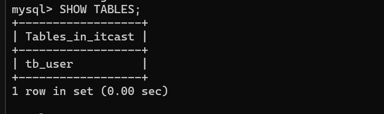
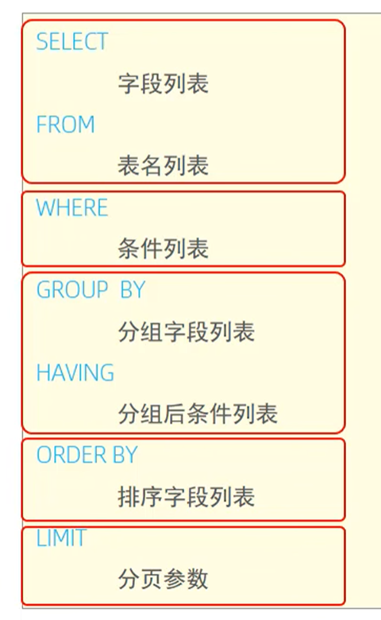
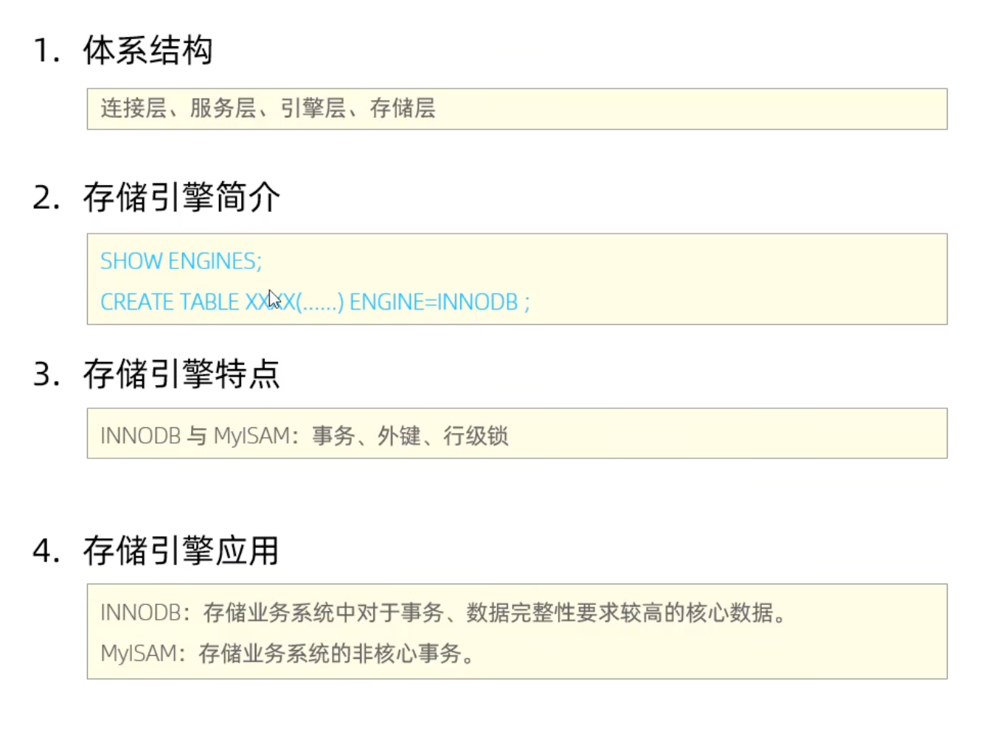
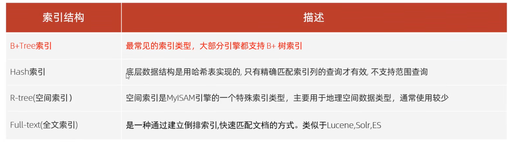
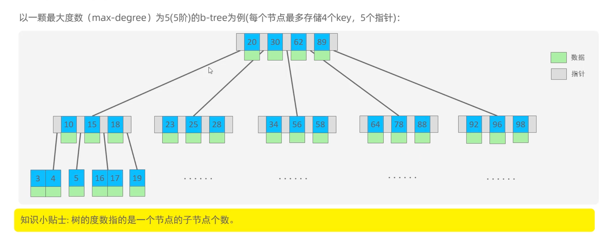
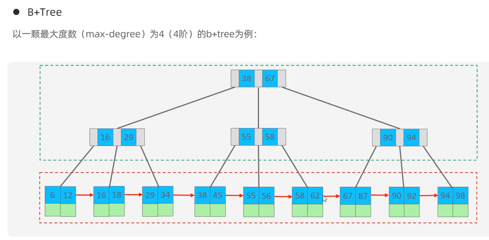
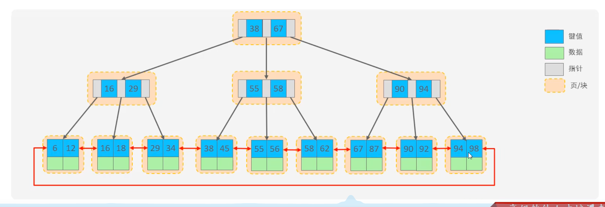
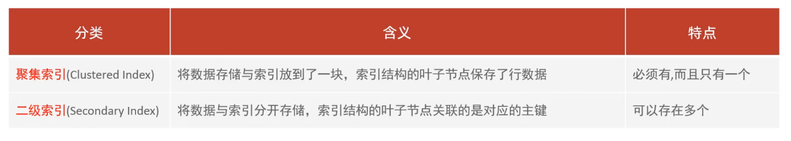
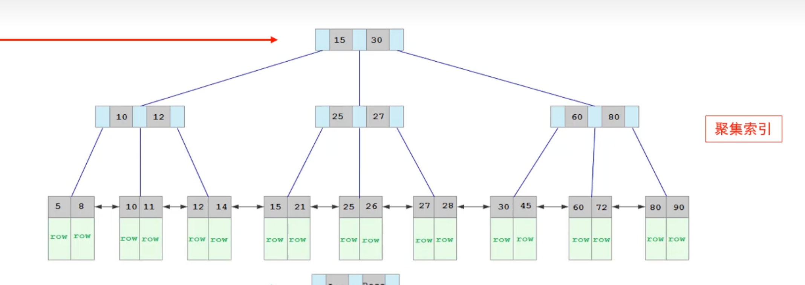
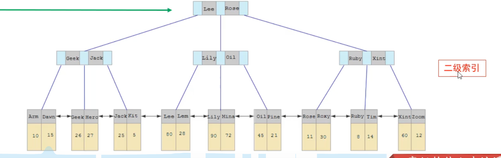

# MySQL笔记

[toc]


## 一、 MySQL相关概述

## 数据库相关概念

**数据库管理系统（DBMS）**DataBase：按照一定的数据结构来组织、存储和管理数据的仓库

**数据库（DB）**Database Management System

**关系型数据库管理系统（RDBMS）**Relational Database Management System

**非关系型数据库：**不使用关系型数据库结构的数据库，是对关系型数据库的补充

**结构化查询语言（SQL）**Structured Query Language：一种操作关系型数据库的编程语言，定义了一套操作关系型数据库统一SQL标准


**关系型数据库（RDBMS）**

**概念：**由多张相互关联的二维表组成的数据库

**特点：**

* **使用表结构存储数据**，格式统一，便于维护
* **使用SQL语言操作**，标准统一，使用方便

不通过表结构存储数据的数据库被称为非关系型数据库


**MySQL数据库的数据模型**

下载完MySQL之后，一单计算机运行了MySQL进程，计算机就可以被当作为MySQL数据库服务器**Server**。

客户端连接到MySQL数据库中的**数据库管理系统DBMS**，可以通过**SQL语句**通过DBMS来创建数据库，也可以通过SQL语句来通过数据库管理系统在指定的数据库中创建不同的表。

在一个数据库管理系统中可以创建多个数据库，在一个数据库中可以创建多张表（二维表），在表中可以存储多个记录


**MySQL启动**

在Powershell中输入`net start mysql84`(我的版本为8.4)，输入`net stop mysql84`则会关闭


**MySQL客户端连接**

1. 使用自带的客户端命令行
2. 在powershell中输入`mysql [-h 127.0.0.1][-p 3306] -u root -p`。  


## 二、SQL语句

**SQL通用语法**

* SQL语句可以单行或多行书写，**以分号结尾**
* SQL语句可以使用空格/缩进来增强语句的可读性
* MySQL数据库的SQL语句不区分大小写，关键字建议使用大写
* 注释：
  *  单行注释： -- 注释内容 或 # 注释内容（MySQL特有）
  * 多行注释： /* 注释内容*/

**MySQL数据类型**

**数值类型：**

**1. 整数类型**

| 类型          | 大小   | 有符号范围 (Signed)                                    | 无符号范围 (Unsigned)          | 描述     |
| :------------ | :----- | :----------------------------------------------------- | :----------------------------- | :------- |
| TINYINT       | 1 字节 | -128 ~ 127                                             | 0 ~ 255                        | 小整数   |
| SMALLINT      | 2 字节 | -32,768 ~ 32,767                                       | 0 ~ 65,535                     | 大整数   |
| MEDIUMINT     | 3 字节 | -8,388,608 ~ 8,388,607                                 | 0 ~ 16,777,215                 | 大整数   |
| INT / INTEGER | 4 字节 | -2,147,483,648 ~ 2,147,483,647                         | 0 ~ 4,294,967,295              | 大整数   |
| BIGINT        | 8 字节 | -9,223,372,036,854,775,808 ~ 9,223,372,036,854,775,807 | 0 ~ 18,446,744,073,709,551,615 | 极大整数 |

**2. 浮点数类型**

* FLOAT: 4 字节，单精度浮点数，范围：-3.402823466 E+38 ~ 3.402823466351 E+38，近似值
* DOUBLE: 8 字节，双精度浮点数，范围：-1.7976931348623157 E+308 ~ 1.7976931348623157 E+308，近似值
* DECIMAL(M, D): 精确值，M 是总位数，D 是小数位数。例如，DECIMAL(5, 2)可以存储 123.45

---

**字符串类型**

| 类型       | 大小 / 限制                  | 描述                       |
| :--------- | :--------------------------- | :------------------------- |
| CHAR(N)    | 固定长度，最多 255 个字符    | 检索速度快                 |
| VARCHAR(N) | 可变长度，最多 65,535 个字符 | 常用，根据实际长度占用空间 |
| TINYBLOB   | 不超过 255 个字符            | 二进制形式短文本           |
| TINYTEXT   | 最多 255 个字符              | 短文本字符串               |
| BLOB       | 最多 65,535 字符             | 二进制形式长文本数据       |
| TEXT       | 最多 65,535 字符             | 长文本数据                 |
| MEDIUMBLOB | 最多 16,777,215 字符         | 二进制形式中等长度文本     |
| MEDIUMTEXT | 最多 16,777,215 字符         | 中等长度文本数据           |
| LONGBLOB   | 最多 4,294,967,295 字符      | 二进制形式极大文本         |
| LONGTEXT   | 最多 4,294,967,295 字符      | 极大文本数据               |

---

**日期时间类型**

| 类型      | 大小   | 格式                | 范围                                       |
| :-------- | :----- | :------------------ | :----------------------------------------- |
| DATE      | 3 字节 | YYYY-MM-DD          | 1000-01-01 至 9999-12-31                   |
| TIME      | 3 字节 | HH:MM:SS            | -838:59:59 至 838:59:59                    |
| YEAR      | 1 字节 | YYYY                | 1901 至 2155                               |
| DATETIME  | 8 字节 | YYYY-MM-DD HH:MM:SS | 1000-01-01 00:00:00 至 9999-12-31 23:59:59 |
| TIMESTAMP | 4 字节 | YYYY-MM-DD HH:MM:SS | 1970-01-01 00:00:01 至 2038-01-19 03:14:07 |

---

**布尔类型**

* 类型名: BOOLEAN 或 BOOL
* 特点: 底层会自动转换成 TINYINT(1)，赋值时可以用 FALSE 和 TRUE，也可以使用 0 和 1

---

**3.4.5 枚举类型**

**ENUM**

* 语法: ENUM('value1', 'value2', ..., 'valueN')
* 特点:
    1. 只能存储预定义列表中的一个字符串。
    2. 如果没有指定默认值，那么可以取空值 NULL。指定默认值后会默认取默认值。如果未指定默认值且不能为空，会默认取第一个值。
    3. 索引会按照列表顺序从 1 开始。空字符串 '' 的索引为 0（如果允许空值）。


**SQL分类**

| 分类 | 全称                       | 说明                                                 |
| ---- | -------------------------- | ---------------------------------------------------- |
| DDL  | Data Definition Language   | 数据定义语言，用来定义数据库对象（数据库，表，字段） |
| DML  | Data Manipulation Language | 数据操作语言，用于对数据库表中的数据进行增删改       |
| DQL  | Data Query Language        | 数据查询语言，用来查询数据库中表的记录               |
| DCL  | Data Control Language      | 数据库控制语言，用来创建数据库用户、控制数据库的访问 |


### DDL语句

#### DDL-数据库操作

**查询**： 

```SQl
# 查询所有数据库
SHOW DATABASES;

# 查询当前数据库
SELECT DATABASE();
```

**创建：**

```sql
#创建
CREATE DATABASE [IF NOT EXISTS] 数据库名 [DEFAULT CHARSET 字符集] [COLLATE 排序规则];
```

括号中的是可选项，可加可不加

**删除：**

```sql
DROP DATABASE [IF EXISTS]数据库名;
```

使用：

```sql
USE 数据库名;
```


#### DDL-表操作

##### 1.DDL-表操作-创建

```sql
CREATE TABLE 表名（
	字段1  类型 [COMMENT 字段1注释] ,
	字段1  类型 [COMMENT 字段1注释] ,
	字段1  类型 [COMMENT 字段1注释] ,
	字段1  类型 [COMMENT 字段1注释] ,
	... 
	字段n  类型 [COMMENT 字段n注释] 
）[COMMENT 表注释];
```


举例创建一个表：

| id   | name | age  | gender |
| ---- | ---- | ---- | ------ |
| 1    | 张三 | 28   | 男     |
| 2    | 李四 | 29   | 男     |
| 3    | 王五 | 27   | 女     |

使用SQL建表语句如下：

```sql
		mysql> CREATE TABLE tb_user(
   			 -> id TINYINT COMMENT '编号',
  			 -> name VARCHAR(50) COMMENT '姓名',
 			 -> gender VARCHAR(1) COMMENT '性别'
 			 -> ) COMMENT '用户表' ;
```


这样就创建了一个名为tb_user的表，注意在最后一个字段行后面不能有逗号，其他字段行后有逗号，所有符号必须使用英文符，不能使用中文符号,[...]中为可选字段。


##### 2.DDL-表操作-查询：

**查看当前数据库所有表**`SHOW TABLES;`  




  **查询表结构**`DESC 表名;`  


 **查询指定表的建表语句**`SHOW CREATE TABLE 表名;`


##### 3.DDL-表操作-修改：

```sql
#格式
#添加字段
ALTER TABLE 表名 ADD 字段名 类型(长度) [COMMENT '注释'][约束];

#修改字段名和字段数据类型
ALTER TABLE 表名 CHANGE 旧字段 新字段 [COMMENT '注释'][约束];

#只修改数据类型
ALTER TABLE 表名 MODIFY 字段名 新数据长度(长度);

#修改表名
ALTER TABLE 表名 RENAME TO 新表名;
```


##### 4.DDL-表操作-删除：

```sql
# 格式
#删除字段
ALTER TABLE 表名 DROP 字段名;

#删除表(即删除表结构又删除表数据)
DROP TABLE [IF EXISTS] 表名;

#删除指定表，并重新创建该表(相当于清空数据)
TRUNCATE TABLE 表名;
```


**完整代码实例：**

```sql
#创建一个员工信息表
CREATE TABLE employee(
	id INT COMMENT '编号' ,
    workid VARCHAR(10) COMMENT '员工工号',
    name VARCHAR(10) COMMENT '员工姓名',
    gender CHAR(1) COMMENT '性别',
    age TINYINT COMMENT '年龄',
    idcard  CHAR(18) COMMENT '身份证号',
    workdate DATE COMMENT '入职时间'
)COMMENT '员工信息表';

#查询表
SHOW TABLES;

#查询表结构
DESC employee;

#查询建表信息
SHOW CREATE TABLE employee;

#添加字段
ALTER TABLE employee ADD nickname VARCHAR(20) COMMENT '昵称';

#修改字段和字段数据类型
ALTER TABLE employee CHANGE nickname username VARCHAR(30) COMMENT '用户名';

#删除字段
ALTER TABLE employee DROP username;

#修改表名
ALTER TABLE employee RENAME TO emp;

#删除表并重建
TRUNCATE TABLE emp;

#删除表
DROP TABLE IF EXISTS emp;
```


### DML语句

##### 1.DML-插入

```sql
# 格式
# 给指定字段添加数据
INSERT INTO 表名 (字段1,字段2,...) VALUES (值1,值2,...);

# 给所有字段添加数据
INSERT INTO 表名 VALUES (值1,值2,值3,...),;

# 批量添加数据
INSERT INTO 表名 (字段1,字段2,...) VALUES (值1,值2,...),(值1,值2,...),(值1,值2,...);

# 批量添加数据
INSERT INTO 表名 VALUES (值1,值2,...),(值1,值2,...),(值1,值2,...);
```


例如:

```sql
# 给指定字段添加数据
INSERT INTO employee (id, name, gender, age, workdate)
VALUES (3, 'wangwu', '男', 10, '2000-01-01');

# 给所有字段添加数据
INSERT INTO employee
VALUES (4, '4', 'zhaoliu', '男', 19, '987654321012345678', '2005-03-03');

# 给所有字段批量添加数据
INSERT INTO employee
VALUES (5, '5', 'xiaoming', '男', 19, '988954321012345678', '2005-03-03')
     , (6, '6', 'xiaohong', '女', 19, '191919191991919191', '2006-05-05');
```


##### 2.DML-修改

```sql
# 格式
UPDATE 表名 SET 字段1=值1,字段2=值2,...[WHERE 条件];
```

修改语句的条件可以有,也可以没有,如果没有条件,则会修改整张表的所有数据

例如:

```sql
# 修改数据,将id为1的员工信息的name字段修改为小张
UPDATE employee
SET name = '小张'
WHERE id =1;

# 修改数据,将id为2的员工信息的name修改为小王,姓名改为女
UPDATE employee
SET name = '小王',
    gender = '女'
WHERE id =2;

# 修改所有员工的入职日期为 2026-04-03
UPDATE employee
SET workdate = '2026-04-03';
```

修改多个字段,中间用逗号隔开

##### 3.DML-删除

```sql
# 格式
DELETE FROM 表名 [WHERE 条件];
```

* DELETE语句的条件可以有也可以没有,如果没有条件,则会删除整张表的所有数据
* DELETE语句不能删除单个字段的值,如果需要删除,可以使用UPDATE语句将其置为null

例如:

```sql
# 将所有gender为女的员工删除
DELETE
FROM employee
WHERE gender = '女';
```


### DQL语句

*Data Query Language*

分类:

**基本查询、条件查询、分组查询、排序查询、分页查询**

##### DQL-基本查询

```sql
# 查询多个字段
SELECT 字段1,字段2,字段3...FROM 表名;
SELECT * FROM 表名;

# 设置别名(AS可省略)
SELECT 字段1 [AS 别名1],字段2 [AS 别名2]...FROM 表名;

# 去除重复记录
SELECT DISTINCT 字段列表 FROM 表名;
```

例如:

```sql
-- 基础查询
# 查询指定字段name,id
SELECT name, id
FROM emp;

# 查询所有字段
SELECT *
FROM emp;

# 查询所有员工的入职日期,并起别名
SELECT entrydate AS '入职日期'
FROM emp;

# 查询所有员工的职位不要重复
SELECT DISTINCT job '职位'
FROM emp;

```


##### DQL-条件查询



**条件:**

| **比较运算符**      | **功能**           | **补充/注意事项**                                   |
| ------------------- | ------------------ | --------------------------------------------------- |
| >                   | 大于               | 常用于数值或日期比较                                |
| >=                  | 大于等于           |                                                     |
| <                   | 小于               |                                                     |
| <=                  | 小于等于           |                                                     |
| =                   | 等于               | 注意：判断 NULL 不能用 =，要用 IS NULL              |
| <> 或 !=            | 不等于             | 建议统一使用一种风格，阿里手册通常不强制，但推荐 != |
| BETWEEN ... AND ... | 在某个范围之内     | **包含**最小值和最大值（闭区间）                    |
| IN(...)             | 在之后的列表中的值 | 多选一。例：`id IN(1, 2, 3)`                        |
| LIKE 占位符         | 模糊匹配           | `_` 匹配单个字符，`%` 匹配任意个字符                |
| IS NULL             | 是 NULL            | 专门用来判断数据库中的空值                          |


| **逻辑运算符** | **功能** | **补充/注意事项**                           |
| -------------- | -------- | ------------------------------------------- |
| AND 或 &&      | 并且     | 多个条件同时成立。**推荐使用关键字 AND**    |
| OR 或 \|\|     | 或者     | 多个条件任意一个成立。**推荐使用关键字 OR** |
| NOT 或 !       | 非，不是 | 取反。例：`NOT IN(1, 2)`                    |

**1.关于 BETWEEN ... AND ...**：

* **顺序不能乱**：必须是 `BETWEEN 小值 AND 大值`。如果你写 `BETWEEN 30 AND 20`，MySQL 不会报错，但它会返回空结果。

**2.关于 IS NULL vs = NULL**：

* 在 SQL 中，`NULL` 代表“未知”，它不等于任何值，甚至不等于它自己。
* **错误写法**：`WHERE age = NULL` (永远查不到结果)。
* **正确写法**：`WHERE age IS NULL`。

**3.关于逻辑运算符的优先级**：

* **AND 的优先级高于 OR**。
* 如果写 `WHERE age > 20 OR age < 10 AND gender = '男'`，SQL 会先处理 `AND`。
* **习惯**：永远给 `OR` 条件加上括号 `( )`，比如 `WHERE (age > 20 OR age < 10) AND ...`。

例如:

```sql
-- 条件查询
# 1.查询年龄等于60的员工
SELECT *
FROM emp
WHERE age = 60;

# 2.查询年龄小于20等于的员工信息
SELECT *
FROM emp
WHERE age <= 20;

# 3.查询没有职位的员工信息
SELECT *
FROM emp
WHERE job IS NULL;

# 4.查询有职位的员工信息
SELECT *
FROM emp
WHERE job IS NOT NULL;

# 查询年龄不等于88的员工信息
SELECT *
FROM emp
WHERE age != 88;

SELECT *
FROM emp
WHERE age <> 88;

# 查询性别为女且年龄小于25岁的员工信息
SELECT *
FROM emp
WHERE age < 25 && job = '会计';

# 查询年龄在15岁(包含)到20岁(包含)且薪资在7000(包含)到15000(包含)的员工信息
SELECT *
FROM emp
WHERE age BETWEEN 15 AND 20 && salary >= 7000
  AND salary <= 15000;

# 查询年龄等于18或20或者40的员工信息
SELECT *
FROM emp
WHERE age = 18
   OR age = 20
   OR age = 40;

SELECT *
FROM emp
WHERE age IN (18, 20, 40);

# 查询所有姓名为2个字的员工信息
SELECT *
FROM emp
WHERE name like '__';

# 查询所有入职日期为该月5号的员工信息
SELECT *
FROM emp
WHERE entrydate like '%05';
```

**聚合函数:**

| **函数**  | **功能** | **例子**   | **补充**                        |
| --------- | -------- | ---------- | ------------------------------- |
| **COUNT** | 统计数量 | `COUNT(*)` | 统计总行数（最常用，包含 NULL） |
| **SUM**   | 求和     | `SUM(age)` | 仅对数值类型有效                |
| **AVG**   | 平均值   | `AVG(age)` | 仅对数值类型有效                |
| **MAX**   | 最大值   | `MAX(age)` | 可用于数值、日期、字符串        |
| **MIN**   | 最小值   | `MIN(age)` | 可用于数值、日期、字符串        |

注意事项:

1. NULL 值会自动被“无视”

所有的聚合函数（除了 `COUNT(*)`）都会**自动忽略 NULL 值**。

* **例子**：如果公司有 10 个人，其中 2 个人没填工资（NULL）。
* 执行 `AVG(salary)` 时，分母是 **8**，而不是 10。
* 执行 `COUNT(salary)` 时，结果也是 **8**。

> **建议**：统计总行数永远用 **`COUNT(*)`**，它是数据库专门优化过的，既准又快。

2. 不能在 WHERE 子句中直接使用聚合函数

* **错误写法**：`SELECT * FROM emp WHERE age = MAX(age);` （报错：Invalid use of group function）
* **原因**：`WHERE` 是在聚合之前过滤行的。你还没聚合呢，哪来的 `MAX`？
* **正确姿势**：以后我们会学“子查询”或者 `HAVING` 来解决这个问题。


例如:

```sql
-- 聚合函数
# 1.统计该企业员工数量(null值不参与计算)
SELECT COUNT(*) AS '员工数量'
FROM emp;

# 2.统计该企业员工的平均年龄
SELECT AVG(age) AS '平均年龄'
FROM emp;

# 3.统计该企业员工的最大年龄
SELECT MAX(age) AS '最大年龄'
FROM emp;

# 4.统计该企业员工的最小年龄
SELECT MIN(age) AS '最小年龄'
FROM emp;

# 5.统计该企业职位为开发的员工的薪资之和
SELECT SUM(salary) AS '开发部总薪资'
FROM emp
WHERE job = '开发';
```


##### DQL-分组查询

```sql
# 格式
SELECT 字段列表 FROM 表名 [WHERE 条件] GROUP BY 分组字段名 [HAVING 分组后过滤条件];
```

***WHERE和HAVING的区别(重点!!!)*:**

* WHERE是在**分组前**进行过滤，不满足条件的数据不参与分组，且**不能**在WHERE中写聚合函数

* HAVING是在**分组后对分组后的结果进行过滤**，**可以**（且通常必须）配合聚合函数使用


注意事项:

* 执行顺序: WHERE>聚合函数>HAVING
* 分组之后,查询的字段一般是聚合函数和分组字段,查询其他字段没有意义

举例：

```sql
-- 分组查询

# 根据职位分组,统计不同职位的员工数量
SELECT job, COUNT(*)
FROM emp
GROUP BY job;

# 根据职位分组,统计不同职位的员工的平均年龄
SELECT job, AVG(age)
FROM emp
GROUP BY job;

# 查询年龄小于45的员工,并根据职位分组,获取员工数量大于等于3的职位
SELECT job, COUNT(*)
FROM emp
WHERE age < 45
GROUP BY job
HAVING (COUNT(*) >= 2);
```


##### DQL-排序查询

```sql
SELECT 字段列表 FROM 表名 [WHERE 条件] [GROUP BY 分组字段] [HAVING 过滤] ORDER BY 字段1 排序方式1, 字段2 排序方式2;
```

**ASC**：升序（默认值）。从小到大，默认是升序，所以可以省略不写

**DESC**：降序。从大到小

如果是多个字段排序,当第一个字段值相同时,才会根据第二个字段进行排序

举例：

```sql
-- 排序查询

# 1.根据年龄对公司的员工进行升序排序
SELECT *
FROM emp
ORDER BY age ASC;

SELECT *
FROM emp
ORDER BY age;  # 默认采用升序,所以ASC可以省略不写


# 2.根据入职时间,对员工进行降序排序
SELECT *
FROM emp
ORDER BY entrydate DESC ;

# 3.根据年龄对公司的员工进行升序排序,年龄相同,再按照入职时间降序排序
SELECT *
FROM emp
ORDER BY age , entrydate DESC ;
```


##### DQL-分页查询

```sql
# 格式
SELECT 字段列表 FROM 表名 LIMIT 起始索引, 查询记录数;
```

**起始索引 = (页码 - 1) * 每页展示记录数**

如果起始索引是 **0**，可以简写,  例如:`LIMIT 0, 10` 等价于 `LIMIT 10`。

**方言问题:**`LIMIT` 是 **MySQL 的方言**。如果使用 Oracle，分页得用 `ROWNUM` 或者 `OFFSET FETCH`，语法完全不同。这是面试常问的数据库差异点。

举例:

```sql
-- 分页查询

# 1. 查询第一页的员工数据,每页展示5条记录
SELECT *
FROM emp
LIMIT 0,5;

# 2. 查询第三页的员工数据,每页展示5条记录
SELECT *
FROM emp
LIMIT 10,5;
```


##### DQL总结:

| **模块**     | **核心关键字**                      | **关键点 / 潜规则**                                          |
| ------------ | ----------------------------------- | ------------------------------------------------------------ |
| **基础查询** | `AS`, `DISTINCT`                    | `AS` 起别名建议带空格；`DISTINCT` 去重作用于所有选定列。     |
| **条件查询** | `BETWEEN...AND`, `IN`, `LIKE`       | `_` 匹配单个，`%` 匹配任意；`IS NULL` 是判断空的唯一正确姿势。 |
| **聚合函数** | `COUNT`, `SUM`, `AVG`, `MAX`, `MIN` | **纵向计算**。自动忽略 NULL 值；`COUNT(*)` 是统计总行数的神。 |
| **分组查询** | `GROUP BY`, `HAVING`                | `WHERE` 不能接聚合函数，`HAVING` 可以。`SELECT` 字段必须与分组字段对应。 |
| **排序查询** | `ORDER BY`, `ASC`, `DESC`           | 多字段排序时，只有当前一个字段值相同时，才会启动第二个字段排序。 |
| **分页查询** | `LIMIT`                             | 索引从 0 开始。公式：`起始索引 = (页码 - 1) * 每页条数`。    |

**注意事项:**

1. **关于通配符**：尽量避免 `LIKE '%关键词'`（以百分号开头），因为这会导致全表扫描，性能极差。

2. **关于聚合与 WHERE**：`WHERE` 运行在 `GROUP BY` 之前。想根据“平均分”或者“总人数”来过滤需使用 `HAVING`。

3. **关于 SELECT ***：在练习时用 `*` 很爽，但在真实项目中，需**明确写出字段名**。这不仅能提高性能，还能防止以后表结构变动导致的代码崩溃。

**执行顺序:**

`FROM` (去哪找)

`WHERE` (初步筛选)

`GROUP BY` (分组)

`HAVING` (分组后筛选)

`SELECT` (挑出列)

`ORDER BY` (排序)

`LIMIT` (最后截取分页结果)


### DCL语句

`Data Control Language`,主要用来管理数据库用户（哪些用户可以访问该数据库） ，控制数据库的访问权限（控制每一个用户的访问权限）

#### DCL-用户管理

##### DCL-用户管理-查询用户

```sql
USE mysql;
SELECT * FROM user;
```

##### DCL-用户管理-创建用户

```sql
CREATE USER '用户名'@'主机名' IDENTIFIED BY '密码';
```

将主机名用%代替则可以在任何主机上访问

##### DCL-用户管理-修改密码

```sql
ALTER USER  '用户名'@'主机名'  IDENTIFIED  BY  '新密码';
```

##### DCL-用户管理-删除用户

```sql
DROP USER '用户名'@'主机名';
```

例如:

```sql
-- DCL操作

# 查询用户
USE mysql;
SELECT *
FROM user;

# 创建用户zhangsan, 只能在当前逐句localhost访问，密码123456;
CREATE USER 'zhangsan'@'localhost' IDENTIFIED BY '123456';

# 创建用户lisi, 可以在任意主机访问该数据库,密码为123456;
CREATE USER 'lisi'@'%' IDENTIFIED BY '123456';

#修改密码,将张三的密码修改为654321;
ALTER USER 'zhangsan'@'localhost' IDENTIFIED BY '654321';

# 删除zhangsan@localhost用户
DROP USER 'zhangsan'@'localhost';
```

#### DCL-权限控制

##### DCL-权限控制-查询权限

```sql
SHOW GRANTS FOR '用户名'@'主机名';
```

##### DCL-权限控制-授予权限

```sql
GRANT 权限列表 ON 数据库名.表名 to '用户名'@'主机名';
```

##### DCL-权限控制-撤销权限

```sql
REVOKE 权限列表 ON 数据库名.表名 FROM '用户名'@'主机名';
```

多个权限之间用逗号隔开,  授权时,  数据库名和表名可以用  *  通配,表示所有。

例如:

```sql
-- 权限管理
-- 查询权限
SHOW GRANTS FOR 'lisi'@'%';

# 授予lisi这个用户在数据库itcast上的DELETE权限
GRANT DELETE ON itcast.* TO 'lisi'@'%';

# 撤销lisi这个用户在数据库itcast上的所有权限
REVOKE ALL ON itcast.* FROM 'lisi'@'%';
```

## 三、函数

**函数是一段可以直接被另一段程序所调用的程序或代码**

### 字符串函数

| **函数**                   | **功能**                                    | 补充                                                         |
| -------------------------- | ------------------------------------------- | ------------------------------------------------------------ |
| **`CONCAT(S1,S2,...Sn)`**  | 字符串拼接，将 S1, S2...Sn 拼接成一个字符串 | **坑：** 参数中有 `NULL` 则结果全为 `NULL`。业务中常用 `CONCAT_WS` 避坑。 |
| **`LOWER(str)`**           | 将字符串全部转为小写                        | 面试题：实现**不区分大小写**的模糊查询时必用。               |
| **`UPPER(str)`**           | 将字符串全部转为大写                        | 格式化验证码、身份证后缀等场景。                             |
| **`LPAD(str,n,pad)`**      | 左填充，用 pad 对左边填充，达到 n 长度      | **实战：** 生成 6 位流水号（如 `000001`）。                  |
| **`RPAD(str,n,pad)`**      | 右填充，用 pad 对右边填充，达到 n 长度      | 报表对齐，或隐藏手机号后几位（虽然常用 `REPLACE`）。         |
| **`TRIM(str)`**            | 去掉字符串头部和尾部的空格                  | **重要：** 清洗爬虫数据或用户输入时的“保命”函数。            |
| **`SUBSTRING(str,s,len)`** | 截取字符串，从 s 位置起取 len 长度          | **注意：** MySQL 下标从 **1** 开始（不是 0）。               |
| **`REPLACE(str,f,t)`**     | 字符串替换，将 f 换成 t                     | 常用场景：敏感词过滤、脱敏处理。                             |
| **`LENGTH(str)`**          | 获取字符串的**字节**长度                    | **面试考点：** 英文占 1 字节，UTF-8 中文通常占 3 字节。      |
| **`CHAR_LENGTH(str)`**     | 获取字符串的**字符**长度                    | 统计字数（不分中英文），如“限制评论 140 字”。                |


### 数值函数

| **函数**         | **功能**                       | **补充**                                                     |
| ---------------- | ------------------------------ | ------------------------------------------------------------ |
| **`CEIL(x)`**    | **向上取整**                   | 只要有小数就进位。**场景：** 比如 11 个人，每车坐 5 人，需要几辆车？`CEIL(11/5) = 3`。 |
| **`FLOOR(x)`**   | **向下取整**                   | 直接抹除小数部分。**场景：** 优惠券满减，不满 1 元的部分直接舍弃。 |
| **`MOD(x,y)`**   | **取模（取余数）**             | 比如 `MOD(10,3) = 1`。**场景：** 判断奇偶数，或者分表存储时的 ID 分片。 |
| **`RAND()`**     | 返回 **0~1** 之间的随机数      | **面试必考：** 如何取 1~100 的随机整数？`FLOOR(RAND()*100) + 1`。 |
| **`ROUND(x,y)`** | **四舍五入**，y 是保留小数位数 | 比如 `ROUND(2.345, 2) = 2.35`。**场景：** 财务结算、商品单价展示。 |
| **`ABS(x)`**     | 返回绝对值                     | 无论正负都转为正数。常用于计算两个数值的“差值”而不考虑方向。 |


### 日期函数

| **函数**                              | **功能**                        | **补充**                                                     |
| ------------------------------------- | ------------------------------- | ------------------------------------------------------------ |
| **`CURDATE()`**                       | 返回当前**日期**                | 只有年月日，如 `2026-04-05`。                                |
| **`CURTIME()`**                       | 返回当前**时间**                | 只有时分秒，如 `12:22:01`。                                  |
| **`NOW()`**                           | 返回当前**日期和时间**          | **最常用**，包含年月日时分秒。                               |
| **`YEAR(date)`**                      | 获取指定日期的**年份**          | 常用于统计年度报表。                                         |
| **`MONTH(date)`**                     | 获取指定日期的**月份**          | 返回 1 到 12。                                               |
| **`DAY(date)`**                       | 获取指定日期的**天**            | 返回几号。                                                   |
| **`DATE_ADD(d, INTERVAL expr type)`** | 返回日期 d 加上一段时间后的日期 | **核心：** 比如 `DATE_ADD(NOW(), INTERVAL 7 DAY)` 是 7 天后。 |
| **`DATEDIFF(d1, d2)`**                | 返回两个日期之间的**天数差**    | **注意：** 结果是 `d1 - d2`，可以是负数。                    |


### 流程函数

| **函数**                                               | **功能**                                 | **补充**                                                |
| ------------------------------------------------------ | ---------------------------------------- | ------------------------------------------------------- |
| **`IF(value, t, f)`**                                  | 如果 value 为真，返回 t；否则返回 f      | **最常用：** 相当于 Java 的三元运算符 `? :`。           |
| **`IFNULL(v1, v2)`**                                   | 如果 v1 不为 NULL，返回 v1；否则返回 v2  | **保命函数：** 防止计算中出现 `NULL` 导致整个结果报废。 |
| **`CASE WHEN [k1] THEN [v1] ... ELSE [default] END`**  | **条件分支：** 满足 k1 返回 v1，以此类推 | **核心：** 相当于 `if...else if...else`。非常灵活。     |
| **`CASE [expr] WHEN [v1] THEN [r1] ... ELSE [r] END`** | **等值分支：** 表达式等于 v1 返回 r1     | 相当于 `switch...case`。                                |

## 

## 四、约束

### 约束的分类

| **约束名称** | **关键字**        | **作用**                                 | **补充**                                                     |
| ------------ | ----------------- | ---------------------------------------- | ------------------------------------------------------------ |
| **非空约束** | **`NOT NULL`**    | 强制列不能存储 `NULL` 值。               | **比如**：用户注册，用户名必须填。                           |
| **唯一约束** | **`UNIQUE`**      | 保证列中的所有值都是唯一的。             | 比如：手机号、邮箱不能被多个人占用。                         |
| **主键约束** | **`PRIMARY KEY`** | **非空 + 唯一** 的组合。                 | **核心**：每张表必须有且只有一个（通常是 `id`）。            |
| **默认约束** | **`DEFAULT`**     | 如果不指定值，则使用默认值。             | 比如：状态码默认为 `1`（正常），创建时间默认当前时间。       |
| **检查约束** | **`CHECK`**       | 保证列中的值符合特定条件。               | **注意**：MySQL 8.0.16 之后才正式支持。比如：`age > 0 AND age < 120`。 |
| **外键约束** | **`FOREIGN KEY`** | 让两张表的数据建立连接，保证数据一致性。 | **项目灵魂**：订单表里的 `user_id` 必须在用户表里能找到。    |


**约束演示:**

```sql
# 使用约束条件新建表
CREATE TABLE user
(
    id     int PRIMARY KEY AUTO_INCREMENT COMMENT 'ID',
    name   varchar(10) NOT NULL UNIQUE COMMENT '姓名',
    age    int CHECK ( age > 0 AND age <= 120) COMMENT '年龄',
    status char(1) DEFAULT 1 COMMENT '状态',
    gender char(1) COMMENT '性别'
) COMMENT '员工表';

```

### 外键约束相关操作

* 添加外键：

```sql
# 格式
# 已创建好表后添加
ALTER TABLE 表名 ADD CONSTRAINT 外键名 FOREIGN KEY (外键字段名) REFERENCES 主表（主表列名）;

#创建表时添加
CREATE TABLE 表名(
	字段名 数据类型,
    ...
	CONSTRAINT 外键名 FOREIGN KEY (外键字段名) REFERENCES 主表（主表列名）;
)
```

例如:

```sql
# 添加外键
ALTER TABLE emp
    ADD CONSTRAINT fk_emp_dept_id FOREIGN KEY (dept_id) REFERENCES dept (id);
```

* 删除外键:  

```sql
# 格式
ALTER TABLE 表名 DROP FOREIGN KEY 外键名;
```

例如:

```sql
# 删除外键
ALTER TABLE emp
    DROP FOREIGN KEY fk_emp_dept_id;
```


### 外键级联的四种行为

| **行为关键字**  | **含义 (当父表数据变动时)**                        | **形象理解** | **适用场景**                                             |
| --------------- | -------------------------------------------------- | ------------ | -------------------------------------------------------- |
| **`CASCADE`**   | **级联**：父表删，子表跟着删；父表改，子表跟着改。 | 连坐制       | **常用**。部门解散，员工记录直接清理（或档案同步更新）。 |
| **`SET NULL`**  | **置空**：父表记录没了，子表关联字段设为 `NULL`。  | 变成孤儿     | 部门解散，员工还在，只是暂时没有所属部门。               |
| **`RESTRICT`**  | **限制**：只要子表有数据，父表就不准动。           | 锁定保护     | **默认行为**。防止误删重要基础数据。                     |
| **`NO ACTION`** | **无动作**：和 `RESTRICT` 一样（在 MySQL 中）。    | 拒绝执行     | 严格的数据一致性校验。                                   |

> “既然RESTRICT和NO ACTION在效果上一样，为什么要设计两个关键字？” 你可以这样回答：
>
> 1. **兼容性**：为了遵循 SQL 标准。有些数据库支持“延迟约束检查”（Deferred Constraint Checking），允许你在一个事务里先删父表，再删子表，只要最后提交时数据是一致的就行。但 MySQL 目前不支持这种“先斩后奏”。
> 2. **默认值**：在 MySQL 中，如果你不写 `ON DELETE` 后面的内容，默认触发的就是 `RESTRICT`。


添加行为举例：

```sql
# 添加外键
ALTER TABLE emp
    ADD CONSTRAINT fk_emp_dept_id FOREIGN KEY (dept_id) REFERENCES dept (id) 
        ON DELETE CASCADE ON UPDATE CASCADE;
```

## 五、多表查询

### 多表关系

**一对多（多对一）**

* 案例：部门与员工，一个部门对应多个员工，一个员工只对应一个部门
* **实现方式**：在“多”的一方建立外键，关联“一”的一方的主键


**多对多**

* 案例：学生与课程，一个学生可以选修多门课程，一门课程也可以供多个学生选择
* **实现方式：建立第三张中间表**，中间表至少包含两个外键，分别关联两方主键


**一对一**

* 案例：用户与用户详情的关系
* **实现：**在任意一方加入外键，关联另一方的主键，并且设置外键为唯一的（UNIQUE）

### 内连接

内连接查询的是**两张表交集的部分**

#### 隐式内连接

```sql
# 格式
SELECT 字段列表 FROM 表1 , 表2 WHERE 条件...;
```

例如:

```sql
# 隐式内连接
SELECT e.name, d.name
FROM emp e,
     dept d
WHERE e.dept_id = d.id;
```

#### 显式内连接

```sql
# 格式
SELECT 字段列表 FROM 表1 [INNER] JOIN 表2 ON 条件...;
```

`INNER`可以省略

例如:

```sql
# 显式内连接
SELECT e.name, d.name
FROM emp e
         JOIN dept d ON e.dept_id = d.id;
```

注意:  为了简化表名,  可以为表名起一个别名,  但是在起了别名之后,就**只能通过别名来访问该表的字段**,   而不**能再使用原来的表名进行访问**

### 外连接

| **类型**     | **关键字**   | **效果描述**                                         | **形象比喻**                                      |
| ------------ | ------------ | ---------------------------------------------------- | ------------------------------------------------- |
| **左外连接** | `LEFT JOIN`  | 包含**左表**所有记录，包含左表和右表交集部分的数据。 | 左边是“亲儿子”，全部带走；右边对不上的给 `NULL`。 |
| **右外连接** | `RIGHT JOIN` | 包含**右表**所有记录，包含左表和右表交集部分的数据。 | 右边是“亲儿子”，左边对不上的给 `NULL`。           |

```SQL
# 左外连接
SELECT e.*, d.name 
FROM emp e 
LEFT [OUTER] JOIN dept d ON e.dept_id = d.id;

# 右外连接
SELECT d.*, e.name 
FROM emp e 
RIGHT JOIN dept d ON e.dept_id = d.id;
```

注意点: 

> **左还是右？**
>
> * 在开发习惯中，我们 **99% 的情况都用 `LEFT JOIN`**。因为我们习惯把“主表”写在前面（左边）。
> * “`RIGHT JOIN` 怎么转 `LEFT JOIN`？”
> * **答案**：把两张表的名字换个位置就行。

> **NULL 的处理**：
>
> * 当左外连接查出来的右表数据是 `NULL` 时，这在业务上通常代表“未关联”。比如：查出所有“没下单”的用户（`WHERE order_id IS NULL`）。

> **内连接 vs 外连接**：
>
> * **内连接**：只要对不上，这行数据就消失了（宁缺毋滥）。
> * **外连接**：对不上的也留着，用 `NULL` 填充（保全大局）。

### 自连接

自连接可以是内连接查询,  也可以是外连接查询,  查询的两张表是同一张表,  但是我们在查询时,  其实是将它看作两张表来进行查询的,  ==自连接必须要起别名==。

场景A:查询员工及其领导的名字，只有有领导的员工才会显示**(内连接自连接)**

```sql
SELECT 
    a.name AS '员工', 
    b.name AS '领导'
FROM emp a -- 把 a 想象成员工表
JOIN emp b -- 把 b 想象成领导表
ON a.manager_id = b.id; -- 员工的领导ID = 领导的员工ID
```

场景B：查询员工及其领导的名字，就算没有领导也要查询出来**（左外自连接）**

```sql
SELECT 
    a.name AS '员工', 
    b.name AS '领导'
FROM emp a 
LEFT JOIN emp b 
ON a.manager_id = b.id;
```

### 联合查询

联合查询就是吧多次查询的结果合并起来,拼成一个新的查询结果集

* `UNION`合并后**去重**, (最常用,但是性能略慢,  因为要去重)

```sql
-- 案例：把“薪资大于 5000”和“年龄大于 30”的员工全部查出来
SELECT * FROM emp WHERE salary > 5000
UNION -- 自动去重
SELECT * FROM emp WHERE age > 30;
```


* `UNION ALL`**直接合并所有数据**,包含重复行(性能快,如果确定结果没有重复的,就用这个)

```sql
-- 案例：把“薪资大于 5000”和“年龄大于 30”的员工全部查出来
SELECT * FROM emp WHERE salary > 5000
UNION ALL -- 不去重
SELECT * FROM emp WHERE age > 30;
```


> ### 为什么不直接用 `OR`？
>
> 你可能会问：`WHERE salary > 5000 OR age > 30` 不也能查出来吗？
>
> * **性能差距**：在某些复杂的业务场景下，或者涉及多张不同的表时，`OR` 可能会导致索引失效。而 `UNION` 可以让两次查询分别走各自的索引，最后再汇总。
> * **跨表需求**：如果你想把“已离职员工表”和“在职员工表”的结果拼在一起看，`OR` 是做不到的，必须用 `UNION`。

### 子查询

**概念：**子查询就是将一个查询的结果，当做另一个查询的条件

**子查询的“位置”分类:**  子查询可以出现在 `SELECT`、`FROM`、`WHERE` 后面，但最常用的是在 **`WHERE`** 后面作为过滤条件。

**子查询的分类：**标量子查询，列子查询，行子查询，表子查询

#### ① 标量子查询（结果：一行一列）

内部查询只返回一个孤零零的数值（比如一个 ID、一个最高工资）。

* **操作符**：`=`、`<>`、`>`、`<`、`>=`、`<=`

* **场景**：查询比“张三”入职时间晚的员工。

  ```sql
  -- 第一步：先查销售部的入职日期
  -- 第二步：查入职日期 > 该日期的员工
  SELECT * FROM emp 
  WHERE entrydate > (SELECT entrydate FROM emp WHERE name = '张三');
  ```

#### ② 列子查询（结果：多行一列）

内部查询返回一串 ID 或一串名字。

* **操作符**：`IN`、`NOT IN`、`ANY`、`ALL`

* **场景**：查询“研发部”和“市场部”的所有员工。

  ```sql
  -- 内部查询返回的是 (1, 2) 这样的 ID 列表
  SELECT * FROM emp 
  WHERE dept_id IN (SELECT id FROM dept WHERE name = '研发部' OR name = '市场部');
  ```

#### ③ 行子查询（结果：一行多列）

内部查询返回的是一条完整的记录（比如某人的薪资和直属领导 ID）。

* **操作符**：`=`、`<>`、`IN`、`NOT IN`

* **场景**：查询与“李四”的**薪资**且**直属领导**都相同的员工。

  ```sql
  SELECT * FROM emp 
  WHERE (salary, manager_id) = (SELECT salary, manager_id FROM emp WHERE name = '李四');
  ```

#### ④ 表子查询（结果：多行多列）

内部查询返回的结果就像一张“临时虚拟表”，通常放在 `FROM` 后面。

* **场景**：查询入职日期是“2026-01-01”之后的员工信息及其部门名称。

  ```sql
  -- 先把满足日期的员工抓出来做成一张虚拟表 t
  SELECT t.*, d.name 
  FROM (SELECT * FROM emp WHERE entrydate > '2026-01-01') t 
  LEFT JOIN dept d ON t.dept_id = d.id;
  ```


## 六、事务

### 事务简介

​	事务是一组操作的集合，它是一个不可分割的工作单位，事务会把所有的操作作为一个整体向系统提交获取撤销操作请求，即这些操作要么同时成功，要么同时失败。

​	如果在事务的一组操作中抛出了异常，则会进行回滚事务的操作，从而保证这一组操作的异常不会影响到原数据

​	对于MySQL来说，默认其事务是自动提交的，也就是说，当执行一条DML语句，MySQL会立即隐式的提交事务

### 事务的操作

如果想要更改MySQL的默认提交方式,  则可以使用下面的操作

* **查看/设置事务的提交方式**

```sql
SELECT @@autocommit;
set @@autocommit=0;
set @@autocommit=1;
```

* **提交事务**

```sql
COMMIT;
```

* **回滚事务**

```sql
ROLLBACK;
```

如果不修改事务的提交方式来控制事务,  则用下面的方式来开启事务

* **开启事务**

```sql
START TRANSACTION; 或 BEGIN;
```

### 事务的四大特性(ACID)

* **原子性(Atomicity):**  事务是不可分割的最小单位,要么全部成功,  要么全部失败
* **一致性(Consistency):**  事务完成时,  必须使所有数据都保持一致（比如转账前后，两个人的总钱数是不变的）
* **隔离性（Isolation)：**多个事务并发执行时，互不干扰，保持相对独立
* **持久性（Durability)：**事务一旦提交或回滚，它对数据库中的数据的改变就是永久的。

### 并发事务问题：

当多个用户同时操作数据库时，可能会由于并发产生三大经典问题：

* 脏读：一个事务读到另一个事务还没有提交的数据。
* 不可重复读：一个事务先后读到同一条记录，但是两次读到的数据不同，则为不可重复读
* 幻读：一个事务在按照要求查询数据时，没有对应的行，但是在插入数据时，又发现这行数据已经存在，好像出现了“幻影”

### 隔离级别：

为了解决上面这些“并发打架”的问题，SQL 标准定义了 4 个隔离级别。

| **隔离级别**                    | **解决脏读** | **解决不可重复读** | **解决幻读** | **性能**             |
| ------------------------------- | ------------ | ------------------ | ------------ | -------------------- |
| **Read Uncommitted** (读未提交) | ❌            | ❌                  | ❌            | 最高（裸奔）         |
| **Read Committed** (读已提交)   | ✅            | ❌                  | ❌            | 高（Oracle 默认）    |
| **Repeatable Read** (可重复读)  | ✅            | ✅                  | ❌            | 中（**MySQL 默认**） |
| **Serializable** (串行化)       | ✅            | ✅                  | ✅            | 最低（排队领号）     |

**查看当前的隔离级别：**

```sql
# 查看当前回话的隔离级别
SELECT @@transaction_isolation;

# 查看全局隔离级别
SELECT @@global.transaction_isolation;
```

**设置隔离级别**

```sql
# 针对当前回话设置隔离级别
SET SESSION TRANSACTION ISOLATION LEVEL 隔离级别; 

# 针对全局设置隔离级别(慎用)
SET GLOBAL TRANSACTION ISOLATION LEVEL  隔离级别;
```


## 七、存储引擎

在MySQL的体系结构中，主要分为4层：连接层、服务层、引擎层、存储层（磁盘/磁盘）

其中存储引擎是主要负责数据的存储和读取的具体模块

从MySQL5.5之后InnoDB成为默认的存储引擎，之前MyISAM是默认的存储引擎。还有一些存储引擎例如Memory，ARCHIVE等。

使用`show create table 表名;`查看对应的表的建表语句可以查看该表的存储引擎。

存储引擎是基于表的，不同的表可以有不同的存储引擎。

InnoDB引擎：

* 支持事务
* 支持行级锁
* 支持外键
* 支持MVCC（多版本并发控制）
* 支持崩溃恢复
* 使用B+树索引
* 主键索引是聚簇索引（聚集索引）

MyISAM引擎：

* 不支持事务
* 不支持外键
* 只支持表级锁
* 查询速度在某些简单场景下较快
* 支持B+树索引
* 崩溃恢复能力弱

InnoDB引擎更适合高并发和数据一致性要求较高的业务系统，而MySIAM简单，读性能在一些简单场景下发挥不错，但是在现如今，InnoDB更适合业务开发。

重点区别：

| **对比项** | **InnoDB**               | **MyISAM**                   |
| ---------- | ------------------------ | ---------------------------- |
| 事务       | 支持                     | 不支持                       |
| 锁粒度     | 行级锁为主               | 表级锁                       |
| 外键       | 支持                     | 不支持                       |
| 崩溃恢复   | 较强                     | 较弱                         |
| MVCC       | 支持                     | 不支持                       |
| 聚簇索引   | 支持                     | 不支持                       |
| 适合场景   | 业务系统、并发读写、事务 | 读多写少、简单查询、历史场景 |



## 八、索引

索引是帮助 MySQL 用来高效获取数据的一种数据结构

优点：

* 提高数据检索的速度，降低数据库的 IO 成本
* 通过索引对数据进行排序，降低数据排序的成本降低 CPU 的消耗。

缺点：

* 需要占用空间
* 如果进行增删改等操作，会影响其效率
* 维护成本增加

索引是在存储引擎层实现的，所以不同的存储引擎有不同的索引结构

主要有 B+树索引，Hash 索引，R-Tree 空间索引索引，Full-text 全文索引




B 树：每个节点可以存储多个数据，如果该 B 树的阶数为 5，那么每个节点最多存储 4 个 key，5 个指针，同时度数也为 5，即一个节点的子节点个数最多为 5



B+树：在 B 树的基础上进行了优化，所有的数据都存放在叶子节点，非叶子节点只起到索引的作用，然后叶子节点之间会用链表进行连接



MySQL索引数据结构还对 B+树进行了优化，增加了一个指向相邻叶子节点的链表指针，提高了区间的访问性能：



为什么 InnoDB 引擎采用 B+树进行索引结构呢

因为数据量往往非常巨大，索引和数据主要存储在磁盘页中，影响查询性能的关键因素就是磁盘 IO，需要尽量减少磁盘 IO 的次数，B+树是多叉平衡树，一个节点往往可以存放更多的索引 key 和指针 ，采用 B+树索引结构，往往树很矮，磁盘 IO 的次数少，同时数据都存放在叶子节点，查询稳定性高，叶子节点之间还形成了双向链表，便于范围查询和排序。

相比于 Hash 索引，B+树不仅支持等值查询，还支持范围查询、排序、联合索引和左前缀匹配。


索引的分类：索引主要分为 4 种：主键索引，唯一索引，常规索引，全文索引。

根据索引的存储形式，又可以分为两种：聚集索引、二级索引（辅助索引/非聚集索引）



1. 如果有主键，用主键作为聚集索引
2. 如果没有主键，选择第一个非空唯一索引作为聚集索引
3. 如果连非空唯一索引也没有，InnoDB 会自动生成一个隐藏的 row_id 作为聚集索引

二级索引查询顺序：二级索引先查询到主键，然后去聚集索引查询整行数据，这个过程就叫**回表**

聚集索引：叶子节点存放整行数据，主键索引就是聚集索引



二级索引：叶子节点存放的是主键 



什么是聚集索引？

> 聚集索引是索引结构和数据存储在一起的索引。在 InnoDB 中，主键索引就是聚集索引，B+ 树的叶子节点存放的是整行数据，所以通过主键查询时，找到索引叶子节点就能直接拿到完整记录。
>
> InnoDB 的表数据本身就是按照聚集索引组织的。如果表有主键，就使用主键作为聚集索引；如果没有主键，会选择第一个非空唯一索引；如果都没有，InnoDB 会生成隐藏 row_id。
>
> 聚集索引按主键查询和主键范围查询效率较高，但二级索引查询如果需要完整数据，通常要先查到主键值，再回到聚集索引中查询整行数据，这个过程叫回表。

MySQL 索引有哪些分类？

> 可以从两个角度分类。
>
> 从功能上看，常见索引有主键索引、唯一索引、普通索引和全文索引。主键索引用来唯一标识一行数据，要求唯一且非空；唯一索引保证字段或字段组合不重复；普通索引主要用于加速查询；全文索引用于文本检索。
>
> 从 InnoDB 的存储结构看，索引又可以分为聚集索引和二级索引。InnoDB 中主键索引就是聚集索引，B+ 树叶子节点存放整行数据；其他索引一般是二级索引，叶子节点存放索引列和主键值。如果通过二级索引查询完整行数据，通常需要再根据主键回到聚集索引查询，这个过程叫回表。
