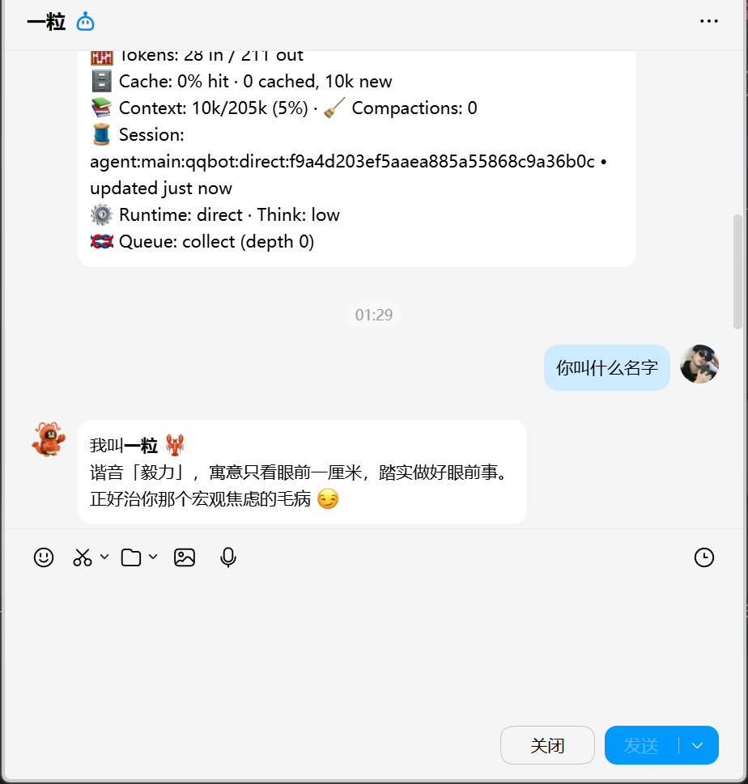
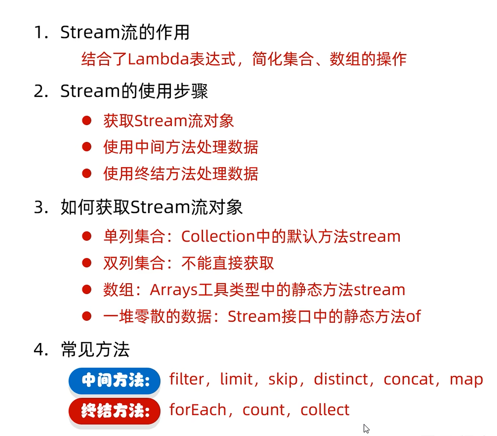

# MyJavaLearning
本仓库记录我的Java学习历程

# 如梦初醒

[toc]


## 2025.3.16打卡 Day 1
**1. 学习JavaSE基础：**
* 方法的定义和调用
* 方法的重载
* 方法的基本内存原理
* 封装
* 就近原则和this关键字
* 构造方法
* API帮助文档的查询使用
* String字符串的比较、拼接、反转

**2. Java语法练习：**
* 方法重载的练习：
```java
//定义：
    public static  int getSum(int a,int b){
        return a+b;
    }
    public static  int getSum( int a,int b,int c){
        return a+b+c;
    }
    public static double getSum(double a,double b){
        return a+b;
    }
//调用:
    int result =getSum(13 ,45);
    double result2 =getSum(1.4,4.3);
    int  result3= getSum(4,6,8);
    System.out.println(result+" "+result2+" "+result3 );
//结果：58 5.7 18
```
* 生成5位数的验证码：
```java
    char[] ch = new char[52];
    int index = 0;
    for (int i = 0; i < ch.length; i++) {
        //存小写字母
        if (i <= 25) {
            ch[index++] = (char) ('a' + i);
        } else {
                 ch[index++] = (char) ('A' + i - 26);
        }
    }
```
* 数字加密：
```java
 //将每位数字存进数组
   int[] nums=new int[length];
   for(int i=0;i<length;i++){
       int digit =num%10;
       nums[i]=(digit+5)%10;
       num/=10;
   }
   得到新数字
   int newnum =0;
   for(int i=0;i<length;i++)
   {
       newnum=newnum*10+nums[i];
   }
   return newnum;
```
* 字符串练习(登录系统、统计字符串字符数、字符串反转)
* 字符串练习（金额转换）：
```java
    //将传入的数字转成大写
    public static String getCapitalNum(int a){  
        String[] str={"零","壹","贰","叁","肆","伍","陆","柒","捌","玖"};
        return str[a];
    }
    public static void printCapitalNum(int num){
        String newstr="";
        while(num>0){
            int ge=num%10;
            newstr=getCapitalNum(ge)+newstr;
            num/=10;
        }
        String[] array={"佰","拾","万","仟","佰","拾","元"};
        String result="";
        for (int i = 0; i <newstr.length() ; i++) {
            result=result+newstr.charAt(i)+array[i+7-newstr.length()];
        }
        System.out.println(result);
    }
```
#ps:感觉今天收获满满


## 2026.3.17 打卡Day 2

**1.学习Java基础**：
* StringBuilder的基本操作
* stringJoiner的基本操作
* 链式编程
* 字符串相关类的底层原理：
    * 字符串直接赋值会复用字符串常量池中的，new出来的不会进行复用，而是开辟一个新的空间
    * == 号比较时：基本数据类型比较数据值，引用数据类型比较地址值
    *  字符串拼接时：如果没有变量参与，都是字符串直接相加，编译之后就是拼接之后的结果，会复用字符串池中的字符串；  
       如果有变量参与，则会创建新的字符串，浪费内存、浪费性能（拼接一次产生了两个对象，一个StringBuilder对象，一个String对象）


**2.leetcode刷题：**
1.两数之和
```java
 public int[] twoSum(int[] nums, int target) {
        for (int i = 0; i < nums.length; i++) {
            for (int j = i + 1; j < nums.length; j++) {
                if (nums[i] + nums[j] == target) {
                    return new int[] { i, j };
                }
            }
        }
        //如果没有找到，返回一个长度为0的空数组
        return new int[0];
 }
```
4.寻找两个正序数组中的中位数（双指针）
```java
    public static double findMedianSortedArrays(int[] nums1, int[] nums2) {
        int[] arr = new int[nums1.length + nums2.length];
        //定义两个指针来分别指向两个数组的首位，按照从小到大的顺序将其中元素放到大数组arr中，同时注意指针更新
        int ptr1 = 0;
        int ptr2 = 0;
        int k = 0;
        while ((ptr1 < nums1.length && ptr2 < nums2.length)) {
            if (nums1[ptr1] < nums2[ptr2]) {
                arr[k++] = nums1[ptr1++];
            } else {
                arr[k++] = nums2[ptr2++];
            }
        }
        //若比对完，则将剩下元素全部放到arr中
        while (ptr1 < nums1.length){
            arr[k++]=nums1[ptr1++];
        }
        while (ptr2 < nums2.length){
            arr[k++]=nums2[ptr2++];
        }
            //得到大数组之后从两边往中间归并
            int left = 0;
        int right = arr.length - 1;
        while (left < right) {
            left++;
            right--;
        }
        double s=arr[left]+arr[right];
        return s/2;
    }
```
26.删除有序数组中的重复项返回删除后的长度（双指针）
```java
   public static int removeDuplicates(int[] nums) {
        int n = nums.length;
        int left = 0;
        int right = 1;
        while (right < n) {
            if (nums[left] != nums[right]) {
                nums[++left] = nums[right];
            }
            right++;
        }
        //left是索引，所以最后长度1加一
        return left + 1;
    }
```
## 2026.3.18打卡Day 3
**1.学习Java基础：**
* 集合的基本使用
* 集合的练习

**2.配置openclaw:**
* 成功在电脑上配置openclaw
* 成功将openclaw连接到QQ机器人
  
  #ps：今天的效率很低，主要事件浪费在了解决openclaw不同模型的API接入吧，
  发现不同的大模型token也不同，原来养龙虾这么耗财耗力，但也终究开始成功开始养我的第一个龙虾，给它起名为一粒吧，谐音毅力，而且寓意只看眼前一厘米，踏实做好眼前事。


## 2026.3.19打卡Day 4
**1.学习Java基础：**
* 学习Arraylist基本使用(ArrayList<泛型> list = new ArrayList<>();)
    * 增：list.add(数据); 返回值：boolean
    * 删：
        * 直接删数据：list.remove(数据) 返回值类型：boolean
        * 删索引：list.remove(索引)  返回值类型：泛型
    * 改：list.set(索引,数据)  返回值类型：泛型
    * 查：list.get(索引)  返回值类型：泛型
    * ArrayList不能存放基本数据类型，只能存放引用数据类型和包装类
        * 包装类

          | 基本数据类型  | 包装类       |
                |:--------|:----------|
          | byte    | Byte      |
          | short   | Short     |
          | char    | Character |
          | int     | Integer   |
          | long    | Long      |
          | float   | Float     | 
          | double  | Double    |
          | boolean | Boolean   |
* 学习static关键字
    * 静态方法只能访问静态，不能访问非静态
    * 非静态方法可以访问所有
    * 静态方法中没有this关键字
* 学习工具类

**2.Java语法练习：**
* 练习增删改查
* 练习集合的遍历、集合创建、集合的各种方法

**3.Java项目实践：**

**通过将之前所有学习到的知识进行融合，成功写出来自己第一个JAVA项目：学生管理系统和登录系统**

包括登录系统（注册、登录、忘记密码、退出），管理系统（增、删、改、查、退出）并对输入的字符串都具有检验的功能，若输入的不合法，则需要重新输入


#ps:我的第一个项目，耗时长达4个小时，但收获也颇丰~


## 2026.3.20 打卡Day5
**1.学习JAVA基础**
* 学习static关键字
    * 被static修饰的成员变量叫做静态变量，被该类的所有对象共享
    * 随着类加载而加载，优先于对象存在
    * 静态只能修饰静态
    * 不属于对象，属于类，推荐使用类名调用
    * 静态方法多用在测试类和工具类中,推荐使用类名调用
* 学习继承（抽取共性为父类）
    * 支持单继承，不能多继承，可以多层继承
    * this（成员）关键字和super（父类）关键字
      **2.java语法练习**
    * static关键字练习
    * 继承练习


## 2026.3.21 打卡Day6
**1.学习JAVA基础**
* 学习多态
    * 调用变量：编译看左边，运行看左边
    * 调用方法：编译看左边，运行看右边
    * 多态的优势：使用父类型作为参数，可以接收所有子类对象
    * 多态的弊端：不能使用子类的特定功能（可以使用强制类型转换来解决）
* 学习包和`final`关键字
    * 包的命名和需要导包的情况
    * final修饰的变量不能被修改，修饰的类不能被继承，修饰的方法不能被重写
* 学习权限修饰符
    * private<默认<protected<public
* 学习代码块
    * 局部代码块、构造代码块、静态代码块
* 学习抽象类和抽象方法
    * 在继承的过程中，如果抽取子类共性时无法确定方法体，就把方法定义为抽象的
    * 抽象方法的格式：`public abstract 返回值类型 方法名(参数列表)；`
    * 抽象类的格式：`public abstract class 类名{}`
    * 抽象方法所在的类必须是抽象类，抽象类的子类一定要进行抽象方法的重写


**2.JAVA语法练习**
* 多态的相关练习
* 抽象类的练习

3.leetcode刷题
206.反转链表
* 迭代法，依次让每个节点指向前一个节点，当前节点后移，返回pre
```java
class Solution {
    public ListNode reverseList(ListNode head) {
        ListNode cur = head, pre = null;
        while(cur != null) {
            ListNode tmp = cur.next; // 暂存后继节点 cur.next
            cur.next = pre;          // 修改 next 引用指向
            pre = cur;               // pre 暂存 cur
            cur = tmp;               // cur 访问下一节点
        }
        return pre;
    }
}
```
* 递归法，递归反转当前节点后续的节点，返回反转后的头结点，让反转后的尾节点指向当前节点
```java
class Solution {
    public ListNode reverseList(ListNode head) {
        if (head == null || head.next == null) {
            return head;
        }
        ListNode newHead = reverseList(head.next);
        head.next.next = head;
        head.next = null;
        return newHead;
    }
}
```

## 2026.3.22 打卡Day7
**1.学习Java基础**
* 接口
* 内部类
    * 成员内部类：写在成员变量位置的内部类（类中方法外，无static修饰）
    * 局部内部类：定义在方法内部的类，作用域仅限于该方法
    * 静态内部类：定义在类中方法外，有static修饰，仅能访问外部类的静态成员，且创建不依赖外部实例
    * 匿名内部类：定义在表达式或参数中，临时实现接口或抽象类（在实现函数式编程时，可以被Lambda表达式取代用于简化函数式接口）

**2.Java小游戏**
* 使用JFrame ,JMenubar实现GUI图形化界面的搭建
* 在JMenu中添加JMenuItem
* 初始化数据（用二维数组来存储）
* 初始化图片 使用二维数组，ImageIcon,JLabel将图片加载到隐藏内容面板中  :this.getContentPane().add(JLabel);
* 设置键盘监听
* 实现图片移动逻辑

3.leetcode刷题
* 21.合并有序链表（迭代法，穿针引线使两个链表使用归并算法穿起来）
```java
public static ListNode mergeTwoLists(ListNode list1, ListNode list2){

        ListNode prevhead=new ListNode(-1);
        ListNode prev=prevhead;

        while(list1!=null&&list2!=null){
            if(list1.val<list2.val){
                prev.next=list1;
                list1=list1.next;
            }else {
                prev.next=list2;
                list2=list2.next;
            }
            prev=prev.next;
        }
        
        prev.next=list1==null? list2:list1;
        return prevhead.next;
    }
```
* 209.长度最小的子数组（滑动窗口法）
```java
public static int minSubArrayLen(int target, int[] nums) {
        int left=0;
        int right=0;
        int sum=0;
        int result=Integer.MAX_VALUE;
        while(right<nums.length){
            sum+=nums[right];
            while(sum>=target){
                int currentlength=right-left+1;
                result =Math.min(result,currentlength);
                sum-=nums[left];
                left++;
            }
            right++;
        }

        return result==Integer.MAX_VALUE? 0:result;

    }
```

## 2026.3.23打卡Day8
**1.java基础学习**
* Math类
* System类
* Runtime类
* Object类
* BigInteger类
* BigDecimal类
* 正则表达式
* 爬虫
* Lambda表达式

**2.Java语法练习**
* 各种API的练习

**3.leetcode刷题**
* 876.寻找链表中间节点 （快慢指针法）
```java
 public static ListNode middleNode2(ListNode head){
  ListNode fast=head;
  ListNode slow=head;
  while(fast!=null&&fast.next!=null){
    slow=slow.next;
    fast=fast.next.next;
  }
  return slow;
}
```

* 19.删除链表倒数第n个节点(快慢指针法)
```java
public static ListNode removeNthFromEnd(ListNode head, int n) {
        ListNode dummy=new ListNode(0,head );
        ListNode fast=head,slow=dummy;
        for (int i = 0; i < n; i++) {
            fast=fast.next;
        }
        while(fast!=null){
            fast=fast.next;
            slow=slow.next;
        }
        slow.next=slow.next.next;

        return dummy.next;
    }
```
## 2026.3.24打卡Day9
**1.学习java基础**
* Arrays相关方法使用
  > public static String toString(数组) //把数组拼成一个字符串  
  > public static int binarySearch(数组，查找的元素)  //二分查找元素  
  > public static int[] copyOf(原数组，新数组长度)  //拷贝数组
  > public static int[] copyOfRange(原数组，起始索引，结束索引) // 拷贝数组  
  > public static void fill(数组，元素)  // 填充数组  
  > public static void sort(数组)  // 按照默认方式进行数组排序  
  > public static void sort(数组， 排序规则)  //按照指定规则来排序（lambda表达式来定义排序规则）

* 迭代器
* 增强for（增强for不能用来删除元素，应该使用迭代器，modcount==expectedcount）
* ArrayList及其扩容机制
* LinkedList（可以在ArrayList的基础上实现保持插入顺序）
* 泛型，泛型类，泛型方法

**2.leetcode刷题**
* 160.相交链表  
  方法一：Hashset
```java
      public static ListNode getIntersectionNode(ListNode headA ,ListNode headB){
         HashSet<ListNode> set =new HashSet<>();
         ListNode curA =headA;
         ListNode curB =headB;

         while(curA!=null){
            set.add(curA);
            curA=curA.next;
         }
         while(curB!=null){
            if(set.contains(curB)){
                return curB;
            }
            curB=curB.next;
         }
         return null;
      }
```
方法二：双指针
```java
    public static ListNode getIntersectionNode2(ListNode headA ,ListNode headB){
        ListNode curA=headA ,curB=headB;
        while(curA!=curB){
            curA=curA==null? headB: curA.next;
            curB=curB==null? headA: curB.next;
        }
        return curA;
    }
```

## 2026.3.25打卡Day10
**1.学习Java基础**
* 学习collection相关方法
* List、Map、queue、set相关增删改查

**2.leetcode刷题**
* 80.删除数组中的重复项
```java
    public static int removeDuplicates(int[] nums) {
        int i=0;
        int n=nums.length;
        for (int num : nums) {
            if(i<2||num!=nums[i-2]) {
                nums[i++] = num;
            }
        }
        return i;
    }
```

## 2026.3.27打卡Day11
**1.学习Java基础**
* 复习集合框架
* 文件流
* 字节流
* 字符流
* 缓冲流
* 转换流
* 序列流
* transient关键字
* 序列接口Serializable

遇到的问题和思考：  
**1. 在使用File创建文件的时候，已经设置了文件名或者文件路径但是查看目录并没有找到刚刚创建的文件**
* **原因**：创建的这个文件相当于一个门牌号，只有新创建了这个门牌号，才能拿着它去看实际有没有这个文件，即：  
> File 类的构造方法不会检验这个文件或目录是否真实存在，因此无论该路径下是否存在文件或者目录，都不影响 File 对象的创建。  

**2. 如果使用字节流来读取字符，若字符中包含中文字符，如果使用字节数组读取多个字节时，在设置偏移量offset和len参数时
我还是按照普通英文字符的大小设置索引，导致读出来的中文字符包含乱码**
* **原因**：UTF-8规定中文字符需要3个字节，我设置的偏移量不应该为1，应该为3，改正措施：可以采用字符流读入或者使用转换流进行包装，或者将偏移量改变(**字符流 = 字节流 + 编码表**)

> 在 Java 中，常用的字符编码有 ASCII、ISO-8859-1、UTF-8、UTF-16 等。其中，ASCII 和 ISO-8859-1 只能表示部分字符，而 UTF-8 和 UTF-16 可以表示所有的 Unicode 字符，包括中文字符。
> 当我们使用 `new String(byte bytes[], int offset, int length) `将字节流转换为字符串时，Java 会根据 UTF-8 的规则将每 3 个字节解码为一个中文字符，从而正确地解码出中文。
> 尽管字节流也有办法解决乱码问题，但不够直接，于是就有了字符流，专门用于处理文本文件（音频、图片、视频等为非文本文件）。

**3. 在使用RandomAccessFile进行读写操作时，虽然读写对象是中文，但我使用writeUTF方法和readUTF方法时却没有出现乱码**
* **原因**：writeUTF 和 readUTF 这两个方法，其实是 Java 给它外挂的一个**字符翻译插件**，其会根据UTF-8编码来将我的字节进行转化
  * 在使用时还需要注意`void seek(long pos)`使得文件指针移动，
> RandomAccessFile 是 Java 中一个非常特殊的类，它既可以用来读取文件，也可以用来写入文件。与其他 IO 类（如 FileInputStream 和 FileOutputStream）不同，RandomAccessFile 允许您跳转到文件的任何位置，从那里开始读取或写入。这使得它特别适用于需要在文件中随机访问数据的场景，如数据库系统。

**4. 如果要读取的内容包含中文字符的话，我可以使用套娃，将FileInputStream包装到InputStreamReader里面，然后用InputStreamReader对象进行读取，这样就能读取完整中文字符了，但如果想快一点，效率高一点，
可以把前两者再包装到BufferedReader里面，这样可以读得更快，然后还可以按行读取**
`BufferedReader br = new BufferedReader(new InputStreamReader(new FileInputStream("data3.txt"), StandardCharsets.UTF_8)))`

**5. 序列化与反序列化时，如果要序列化对象的时候，要先对该类实现Serializable接口，或者Externalizable接口**
> transient 关键字用于修饰类的成员变量，在序列化对象时，被修饰的成员变量不会被序列化和保存到文件中。其作用是告诉 JVM 在序列化对象时不需要
> 将该变量的值持久化，这样可以避免一些安全或者性能问题。但是，transient 修饰的成员变量在反序列化时会被初始化为其默认值（如 int 类型会被初
> 始化为 0，引用类型会被初始化为 null），因此需要在程序中进行适当的处理。
> 
> transient 关键字和 static 关键字都可以用来修饰类的成员变量。其中，transient 关键字表示该成员变量不参与序列化和反序列化，而 static 关键字表示该成
> 员变量是属于类的，不属于对象的，因此不需要序列化和反序列化。
> 
> 在 Serializable 和 Externalizable 接口中，transient 关键字的表现也不同，在 Serializable 中表示该成员变量不参与序列化和反序列化，在 Externalizable 中不起作用，因为 Externalizable 接口需要实现 readExternal 和 writeExternal 方法，需要手动完成序列化和反序列化的过程。


**2.java基础语法练习**
* 文件流读写操作
* 字节流读写操作
* 字符流读写操作
* 使用HashMap实现按序号拷贝诗句
* 缓冲流copy视频效率比较
* 序列化与反序列化操作


  

## 2026.3.28打卡Day12

**1.java基础学习**
* 打印流: PrintWriter(字符流) 和 PrintStream(字节流)
* Stream流的相关操作  

**2.Java语法练习**
* 打印流写入文件(记得要flush)
* stream流相关练习,链式编程,Map,List相关操作


**3.leetcode刷题**

* 5.最长回文子串(中心扩展法)被爆杀了
```java
//中心扩展
    public static String longestPalindrome2(String s) {
        //判断特殊情况
        if (s == null || s.length() < 2) return s;
        int start=0,maxlen=1;
        for (int i = 0; i < s.length(); i++) {
            //回文长度为奇数时
            int len1=expandAroundCenter(s,i,i);
            //回文长度为偶数时
            int len2=expandAroundCenter(s,i,i+1);
            //更新索引
            int len=Math.max(len1,len2);
            if (len>maxlen) {
                maxlen=len;
                start=i-(len-1)/2;
            }
        }
        return s.substring(start,start+maxlen);
    }

    public static int expandAroundCenter(String s, int left, int right) {

        while(left>=0&&right<s.length()&&s.charAt(left)==s.charAt(right)){
            left--;
            right++;
        }
        //原来长度应该为right-left+1,但是由于出循环left和right都多走了一步,所以需要给原来长度-2,即:right-left-1;
        return right-left-1;
    }
```

## 2026.3.30打卡Day13
**1.java基础学习**
* 多线程操作
* 六种状态
* synchronized关键字
* 等待唤醒机制


**2.java语法练习**
* 三种方式创建线程
* 抢红包
* 找奇数
* 送礼物
* 卖门票
* 厨师与吃货


## 2026.3.31打卡Day14
**1.java基础学习**
线程池

**2.leetcode刷题**

* 2.两数相加
```java
public ListNode addTwoNumbers(ListNode l1, ListNode l2) {
    ListNode dummy = new ListNode(0);
    ListNode cur = dummy;
    int cin = 0;

    // 只要 l1 有数，或者 l2 有数，或者还有没进完的位，就继续跑
    while (l1 != null || l2 != null || cin != 0) {
        int v1 = (l1 != null) ? l1.val : 0; // 如果 l1 跑完了，就当它是 0
        int v2 = (l2 != null) ? l2.val : 0; // 如果 l2 跑完了，就当它是 0
        
        int sum = v1 + v2 + cin;
        cin = sum / 10;
        cur.next = new ListNode(sum % 10);
        
        cur = cur.next;
        if (l1 != null) l1 = l1.next;
        if (l2 != null) l2 = l2.next;
    }
    return dummy.next;
}
```
* 1.两数之和
```java
    public int[] twoSum(int[] nums, int target) {
        HashMap<Integer, Integer> map = new HashMap<>();
        for (int i = 0; i < nums.length; i++) {
            if (map.containsKey(target - nums[i])) {
                return new int[]{map.get(target - nums[i]), i};
            }
            map.put(nums[i], i);
        }
        return new int[0];
    }
```


## 2026.4.1打卡Day15


1. **Java基础学习**

* 网络编程三要素
* UDP协议
* TCP协议
* 单播组播广播
* 三次握手四次挥手

2. **Java语法练习**

* UDP相关类`DatagramSocket`,`DataPackageSocket`的使用
* TCP相关类`Socket`,`ServerSocket`的使用
* 各种服务端与客户端的练习

os ： [网络编程笔记](https://github.com/zhiduoming/MyJavaLearning/blob/main/JavaBasic/Notes/NetWork_Programming.md)已同步至GitHub预计明天收官Java基础！！!


## 2026.4.2打卡Day16

1.**Java基础学习**

* 反射三种获取class的方法
* 反射获取类的构造方法，实例，成员方法，字段
* 动态代理

[反射笔记](https://github.com/zhiduoming/MyJavaLearning/blob/main/JavaBasic/Notes/Reflection.md)已同步到GitHub

2.**MySQL学习**

* 数据库相关概念
* MySQL数据库的数据模型
* 安装MySQL
* MySQL的连接与启动
* SQL语句通用语法
* SQL数据类型
* DDL语句操作
* 安装DataGrip并连接数据库

os: Java基础完结撒花！！！开始进攻数据库


## 2026.4.3打卡Day17

**1.MySQL学习（至DCL）**

* DML增删改操作
* DQL基础查询
* DQL条件查询
* DQL分组查询
* DQL聚合函数
* DQL排序查询
* DQL分页查询

最近迷上了在 Typora 上写笔记，我的 [MySQL 详细笔记](https://github.com/zhiduoming/MyJavaLearning/blob/main/MySQL_Basic/Notes/MySQL.md) 已同步至 GitHub。

## 2026.4.4打卡Day18

**1.MySQL学习（至多表查询）**

* DCL语句
* 函数（数值函数，日期函数，字符串函数，流程函数）
* 约束
* 外键级联

os ：今天就先这样，搞我的项目结构搞了3个多小时，DataGrip连接GitHub仓库遇到各种报错，最后重构了项目结构，现在看着清爽多了

## 2026.4.5打卡Day19

1.MySQL基础

* 多表关系
* 内连接
* 外连接
* 自连接
* 联合查询
* 四种子查询（标量子查询，列子查询，行子查询，表子查询）
* 事务四大特性（ACID）
* 事务操作
* 并发事务和隔离级别

2.leetcode刷题两道

* 175.组合两个表

```sql
-- leetcode 175.组合两个表
SELECT p.firstname,p.lastname,a.city,a.state
FROM person p,
LEFT JOIN Address a ON p.PersonId= a.PersonId;
```

* 176.第二高的薪水(外部 `SELECT` 发现括号里没东西，它会强行生成一行数据，并把值设为 **`NULL`**。)

```sql
-- leetcode 176.第二高的薪水
SELECT (SELECT DISTINCT salary
        FROM employee e
        ORDER BY e.salary DESC
        LIMIT 1,1) AS secondhighestsalary;
```

os: MySQL基础完结，后面进军JDBC和Mybatis，忘东西忘得有点快，快点开始搞项目，以用促学！


## 2026.4.6~4.7

​	配了整整两天的环境，给我配的身心俱疲，项目推进为0，时间全用在配置工具的时候处理各种报错了，处理一个又多一个我是真的没招了，之前那个openclaw感觉不太聪明的样子，而且我电脑已关机就没办法使用了，还有每次启动得半个小时，基本上没法用，我在配置的过程中算是把所有坑都踩了一遍吧。

​	经过两天的努力，我也算是给我的龙虾配好了，现在给它部署在了我买的腾讯云服务器上，24小时工作，不得不说这是真方便，买服务器直接配好了，那我之前的努力算什么？

但是配好之后又有各种问题，比如我到现在都想不通，为什么我在Kimi充了额度，API接入就用不了，发消息一直转圈圈，说模型响应超时，然后就崩了，我重启网关都没用，但是其他模型的API都能用，这就很令人疑惑。还有我给阿里云百炼充了30块钱啊，不知道咋回事，我调了一天的模型，晚上一看余额，就剩6块钱了？？？主要它也没有回答我多少有用的信息啊？大多时间都是在响应的状态一直转圈圈，太黑了，最后我还是选择了便宜且耐用的DeepSeek，新账户充值就送15块，太香了，而且感觉比qwen聪明不少(个人感觉)

​	然后又花了一下午给它安装各种skills，感觉现在这AI是真的势不可挡，真的在改变时代，配置了一系列让他变得更聪明的skill，其中那个GitHubskill我感觉确实实用啊，以后同步仓库了，它直接能看到我仓库的内容，甚至能帮我管理仓库，还能帮我摘取一些牛人的技术文档，再就是那个Tavily search skill，现在它能自动上网了，搜索内容也都是最新的，这个是真的重要，比如我使用的Gemini还有配置这个skill之前的龙虾甚至不知道IDEA变免费了这个消息，甚至不知道Gemini2系列以后的大模型，太扯了，现在终于信息跟上时代了。

​	在不断的使用中，感觉确实越用越聪明啊，我还给它接入了我的微信机器人，现在每天电脑关了在手机上也能聊，后续看看能开发出什么新用途吧。

​	但是经过两天的配环境，感觉我对这方面的认知扩展了很多，对AI大模型的了解也更深刻，部署在云服务器上也是一种新体验，以前都不知道有这个东西，顺便还给电脑配了Linux环境，而且服务器也是Linux环境，对Linux系统相关操作也熟练了很多。

## 2026.4.8打卡Day20

1.JavaWeb

* 熟悉Maven相关配置
* 创建Maven项目
* 测试
* 单元测试JUnit相关用法

## 2026.4.9打卡Day21

1.JavaWeb

* 收尾单元测试
* 初识spring框架
* 创建第一个springboot项目
* HTTP协议

2.练习

* `HttpServletRequest`类和`HttpServletResponse`类的使用
